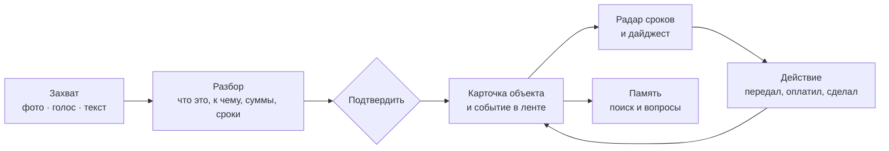

# HomeCRM: исследование и мозговой штурм

| | |
|---|---|
| Дата | 5 октября 2026 |
| Статус | Обсуждён; решения от 5 октября 2026 — в конце раздела 13 и в PRD |
| Следующий шаг | [PRD](02-prd.md) → план разработки |
| Что изучено | Документация, модель данных и аудиты LifeOS; около 20 аналогов; обзоры жалоб пользователей (Reddit, Hacker News, профильные обзоры); российская специфика ЖКХ, документов и каналов связи |

«HomeCRM» — рабочее название. Варианты имени — в разделе 5.1.

---

## 0. Коротко

1. **LifeOS — сильный планировщик, но не система дома.** В его базе всё описывается задачей. Квартир, счётчиков, документов, людей и организаций как объектов нет, поэтому дом живёт в названиях дел: «Снять показания свет и вода», «Поликарбонат для Ленина». Вероятно, именно это ощущается как «что-то не то»: CRM строится вокруг карточек с историей, а не вокруг списка дел.
2. **Сопровождать LifeOS дорого.** Семь контейнеров, два checkout без git, три побайтово синхронизируемые копии одного файла, цепочка «Windows → reverse SSH → VPS → Cloudflare». Основные усилия ушли в спорт (12 модулей) и детские баллы (16 таблиц), а модуль документов и счетов так и остался в отложенных идеях.
3. **На Telegram больше нельзя опираться.** С апреля 2026 он заблокирован в РФ примерно на 95%, а ботов в MAX публикуют только юрлица. Основной канал — устанавливаемое веб-приложение (PWA) с push-уведомлениями.
4. **Рынок.** Западные «семейные ОС» (Cozi, FamilyWall, eeva, Trustworthy, Homechart, OneHaus) закрывают отдельные части и не знают российского ЖКХ. Российские приложения узкие: Госуслуги Дом, учёт показаний, ЧекаЧек для арендодателей. Продукта, который объединяет объекты дома, ЖКХ, семейные дела и разбор бумаг с помощью ИИ, мы не нашли.
5. **Главные боли из обсуждений:** вся ментальная нагрузка лежит на одном человеке; данные разбросаны по приложениям; бумажку или письмо трудно превратить в действие; настройка занимает много времени; партнёр бросает приложение, если запись дольше 10 секунд; уведомлений слишком много.
6. **Концепция — «память и радар дома».** Объекты с лентой событий, единый движок сроков, быстрый захват фото, голосом и текстом. ИИ готовит черновик, человек подтверждает.
7. **Рекомендуемый MVP — «Дом и сроки»:** недвижимость и коммуналка, документы со сроками, контакты, дела с повторами, радар, push-уведомления и перенос данных из LifeOS. Разбор квитанций, счётчиков и документов по фото — следующим релизом, когда для него будет готова модель данных.

---

## 1. Диагноз LifeOS

### 1.1 Что работает — забираем как принципы

| Что | Почему ценно |
|---|---|
| ИИ предлагает, человек подтверждает; ИИ не служит базой данных | Факты не портятся, данным можно доверять |
| Разные смыслы: дата плана, точное время, крайний срок, напоминание | Без этого радар врёт: аудит 5 сентября нашёл, что «просрочено» в интерфейсе и в подборе ИИ считалось по-разному |
| Политики просрочки повторов: `mark_missed`, `carry_over`, `keep_overdue` | Гибкие повторы — одна из главных болей пользователей аналогов |
| Бюджет уведомлений, тихие часы, дедупликация | Ответ на «шум уведомлений» |
| Идемпотентность, аудит, отмена вместо удаления для денег, суммы в копейках | Показания и платежи не теряются и не дублируются |
| Приватность детей: без рейтингов и сравнений | Правильная семейная модель |
| Офлайн-очередь записей в PWA | Нужна и в новом продукте |
| Rental Control MVP: объекты, ожидаемая аренда, платежи | Первый зародыш домашнего CRM |
| Направление Calm Focus и мобильный прототип на React 19 + Vite | Визуальный язык и экраны можно взять за основу |

### 1.2 Что мешает — гипотезы

Это мои выводы по документам и коду. Подтвердите или поправьте — от этого зависит PRD.

| # | Гипотеза | Что видно в проекте | Следствие |
|---|---|---|---|
| H1 | Модель «всё — задача» | В `models.py` есть `Task`, `Reminder`, `RentalProperty`, но нет документов, счётчиков, контактов, техники. Модуль документов и счетов — в отложенных идеях `BACKLOG.md` | У объекта нет истории; на вопрос «где гарантия?» системе нечего ответить |
| H2 | Перекос усилий | Спорт — 12 модулей и 3 копии `workout_engine.py`; баллы — 16 таблиц и этапы CR-001…CR-015 | Бытовое ядро так и не построено |
| H3 | Хрупкая эксплуатация | 7 контейнеров, два checkout без контроля версий, drift-скрипты, ручное копирование в прод, reverse SSH + Cloudflare | Каждое изменение дорогое и рискованное |
| H4 | Зависимость от Telegram | Hermes Admin и Family, Mini App, детские напоминания идут через Telegram | В РФ сервис почти недоступен без VPN |
| H5 | Две поверхности с одинаковой логикой | Dashboard и Mini App развиваются раздельно | Двойная работа и расхождения |
| H6 | Перерисовываются экраны, а не модель | С августа — более 20 выпусков интерфейса: Calm Focus v1–v11, Today Rhythm v1–v3, четыре варианта «Плана», Mobile Focus v1–v2 | Список дел остаётся списком дел, как его ни оформляй |
| H7 | Система одного человека | Внешний доступ настроен на одного пользователя, ИИ-агенты персональные | Семью подключать сложно, другим людям дать невозможно |

### 1.3 Что делать с LifeOS

Рекомендация — **не перестраивать LifeOS, а сделать рядом новый продукт:**

- новый репозиторий под git с первого дня и новая модель данных «объекты + события + сроки»;
- перенос данных: дела, повторы, покупки, идеи, объекты аренды и платежи;
- спорт и детские баллы остаются в LifeOS, новых функций туда не добавляем; если понадобится, позже подключим виджет «тренировка сегодня» через API;
- из LifeOS берём принципы, дизайн-токены Calm Focus и наработки мобильного прототипа, но не код целиком: он завязан на Hermes, Telegram и два checkout.

---

## 2. Какие задачи решает домашний CRM

| # | Задача | Пример | Что делает продукт |
|---|---|---|---|
| 1 | Не пропускать сроки | Поверка счётчика ГВС, ОСАГО, замена паспорта в 20 и 45 лет, налог на имущество до 1 декабря | Единый радар сроков, предупреждения за 60, 30 и 7 дней |
| 2 | Вести коммуналку по нескольким квартирам | С 20 по 25 число снять показания на Цвилинга и на Ленина, передать, сохранить фото | Окна показаний, фото, расчёт расхода, отметка «передано», графики |
| 3 | Найти за 10 секунд | Где гарантия на холодильник? Какой лицевой счёт за свет? Телефон хорошего сантехника? Пароль от Wi-Fi? | Поиск и вопросы к данным дома; всё привязано к объектам |
| 4 | Снять нагрузку с одного человека | Только один взрослый помнит, что и когда платить | Ответственный у каждой записи, общий радар, дела детям |
| 5 | Превратить бумажку в действие | Квитанция, письмо из школы, справка, чек | Фото или пересылка → черновик с суммой, сроком и объектом → подтверждение → платёж, дело или напоминание |
| 6 | Помнить историю дома | Когда меняли смеситель, кто делал, сколько стоило, есть ли гарантия на работы | Лента событий объекта: работы, мастера, чеки, фото |
| 7 | Вести аренду | Кто заплатил и кто должен, коммуналка арендатора, показания при заезде | Объект → договор → арендатор → платежи, акты, фото, налоговые напоминания |
| 8 | Быть готовым к ЧП | Скорая, ребёнок в лагере, нужны полис и группа крови; «если со мной что-то случится» | Экстренная карточка без сети, доступ доверенного человека |
| 9 | Передать дела | Уехал на месяц — кто платит, как включить котёл, где краны | Инструкция к дому, роли, делегирование |
| 10 | Дети и школа | Кружки и их оплата, справка для бассейна, ОГЭ, домашние обязанности | Карточка ребёнка, расписание, документы, простые дела без давления |
| 11 | Сезонные ритуалы | Переобувка, подготовка к зиме, к 1 сентября, к отпуску | Готовые чек-листы, которые запускаются по сезону |
| 12 | Контролировать обязательные платежи | Сколько в месяц уходит на связь, подписки, страховки, кружки; когда продление | Платёжный календарь, предупреждения о продлении |
| 13 | Не забывать людей | День рождения родителей, идея подарка, давно не звонил | Даты, идеи подарков, напоминание связаться |

Задача 3 не надуманная: в опросе, на который ссылается Quicken, 75% людей признают, что важная информация у них плохо организована, а 92% сталкивались с тем, что не могли её найти в нужный момент.

---

## 3. Что говорят пользователи

### 3.1 Главные боли и что они значат для нас

Основа — разбор 1 281 поста на Reddit о семейных органайзерах (Domistiq, апрель 2026) и профильные обзоры.

| Боль | Что делаем |
|---|---|
| Вся ментальная нагрузка на одном человеке (по данным, которые приводит OneHaus, на матерей приходится 71% таких задач) | У каждой записи есть ответственный; общий радар; еженедельный 10-минутный «семейный совет» |
| Данные разбросаны по приложениям и чату, где «ничего не отслеживается» | Один источник правды; связи между объектами; импорт |
| Информацию трудно превратить в действие | Захват фото, голосом и пересылкой; ИИ готовит черновик |
| Жёсткое расписание против непредсказуемой жизни | Гибкие повторы; окна вместо точных дат («с 20 по 25») |
| Задачи, календарь и заметки не связаны | Всё крепится к объекту; единая лента событий |
| Шум уведомлений | Дайджест по умолчанию; бюджет уведомлений; срочное — только реальные сроки |
| Сложные повторяющиеся рутины | Интервалы от события («поверка через 6 лет»), «что наступит раньше» (ТО по пробегу или времени) |
| Нет пассивной видимости | Экран дома на кухне, виджет, дайджест |
| Сложная настройка | Готовые шаблоны объектов; ни одного обязательного поля, кроме названия |
| Конфликты приватности и прав | Личное, семейное и гостевое пространство; секреты по ролям |
| Детей трудно мотивировать | Простые дела детям, без рейтингов (принцип LifeOS) |
| Сбои синхронизации | Один сервер — источник правды; офлайн-очередь; конфликты видны |
| Не видно загрузки по времени | Позже: оценка длительности и ёмкость дня |

### 3.2 Почему такие приложения бросают

- **Выбрали не ту категорию.** Календарь, разбор почты и распределение дел — три разные задачи; семьи меняют по четыре приложения в год (HappyParent HQ).
- **Ручной ввод.** О кухонных экранах вроде Skylight: что-то всё равно должно их наполнять, «обычно это вы, вечером, вручную».
- **Ввод данных и дисциплина.** Автор XDA бросил Grocy через неделю: на каждый продукт много полей, а постоянного учёта от семьи не дождаться. «Если бы я был настолько дисциплинирован, такое приложение мне бы не понадобилось».
- **Правило 10 секунд.** Если добавить дело дольше, партнёр перестаёт пользоваться. Без ответа на вопрос «чья это задача» дела превращаются в пожелания (RemindHer).
- **Нет привычки.** Основная причина оттока — не цена, а то, что человек так и не начал пользоваться регулярно (RevenueCat).

### 3.3 Правила, которые из этого следуют

1. **Ценность с первой записи.** Одна квартира и один счётчик уже дают напоминание о показаниях.
2. **Данные набираются по пути.** Сфотографировал квитанцию — появились поставщик, лицевой счёт и сумма.
3. **Обязательно только название.** Всё остальное можно дополнить потом.
4. **Повод открыть каждый день и каждую неделю.** Ежедневно — «Сегодня» и радар, еженедельно — дайджест.

---

## 4. Аналоги

### 4.1 Кто что делает

| Категория | Примеры | Сильны | Слабы | Что берём |
|---|---|---|---|---|
| Семейные органайзеры | Cozi, FamilyWall, OurHome, Any.do, Todoist | Общий календарь и списки, простота | Ручной ввод; нет документов и объектов; у FamilyWall — перегруженный интерфейс | Скорость ввода, общие списки покупок |
| Уборка и рутина | Tody, Sweepy | Дела по комнатам; приоритет растёт, если давно не делали; ротация | Только уборка | Зоны и динамический приоритет для домашней работы |
| ИИ-помощники семьи (2026) | Ollie, Maple, Google CC, Fambot | Письма и сообщения превращаются в события и напоминания; утренние сводки | Ориентированы на США; только почта или SMS; большинство «останавливаются на осведомлённости»; Ollie — от $25 в месяц | Сводки, разбор входящих, чат как дополнительный вход |
| Семейные сейфы документов | Trustworthy, Quicken LifeHub, Family Folder | Документы, ID, пароли, страховки, экстренные инструкции; ИИ разбирает новый документ и предлагает, куда его положить; роли доступа | Нет дел и быта; ориентированы на США и ЕС | Таксономия папок, разбор документа с подтверждением, роли, экстренный доступ |
| Дом и обслуживание | Homer, HomeZada, HomeOps, Onx | Техника, гарантии, инструкции, графики обслуживания, несколько объектов | Только дом, без семьи и денег | Карточки техники, гарантии, обслуживание |
| «Всё в одном» | eeva, OneHaus, Homechart | Широта: дом, люди, время, деньги; у Homechart — собственное хранение и сейф секретов | Широта в ущерб глубине; Homechart в отзывах называют «пока сырым»; российского ЖКХ нет | Деление на сферы, сейф секретов, собственное хранение |
| Self-hosted конструктор | Grocy, HomeBox, Paperless-ngx, Monica, Vaultwarden, Mealie | Данные у себя, сильные узкие модели | Шесть приложений — та же фрагментация; тяжёлый ввод | Модель документов Paperless (корреспонденты, типы, теги), интеграция с Vaultwarden |
| Личные CRM | Monica, Dex, Clay | Память о людях, дни рождения, «напомни связаться», лента общения | Только люди | Карточка человека и лента взаимодействий |
| Конструкторы | Шаблоны Notion | Гибкость | «Из коробки ничего не работает»; дорого на семью | — |
| Россия: ЖКХ | Госуслуги Дом, «Счётчик! Показания ЖКХ», «Учёт ЖКХ», ДомОкей | Официальная передача показаний (в том числе по фото), оплата, заявки в УК; у частных — экран всех счётчиков, история, напоминания | Только ЖКХ; у Госуслуг нет открытого API | Экран всех счётчиков, фото показаний, расчёт расхода |
| Россия: аренда | ЧекаЧек, 1С:Аренда, АрендаSoft | ЧекаЧек: платежи, ЖКУ, фото показаний против споров, договор за 5 минут, акты | ЧекаЧек — Беларусь и стадия MVP; остальные — для бизнеса | Фотофиксация показаний и состояния при заезде и выезде |
| Россия: семья | «Домашние дела», CoinKeeper, Дзен-мани | Задачи детям и карманные деньги; финансы | Узкие | — |

### 4.2 Свободная ниша

Ни одно из найденных решений не сочетает пять вещей сразу:

1. объектную модель дома — квартиры, счётчики, документы, техника, люди;
2. российское ЖКХ — лицевые счета, окна показаний, поверку, QR-код квитанций;
3. семейные дела и домашнюю работу;
4. разбор бумаг ИИ с подтверждением человеком;
5. собственное хранение данных.

---

## 5. Концепция

### 5.1 Название

- **«Домовой»** — хранитель дома, который всё знает и за всем присматривает. Хорошо подходит ИИ-помощнику: «спросить Домового». Но в RuStore уже есть несколько небольших приложений с таким именем (учёт счётчиков, клиент Home Assistant, сроки продуктов). Если продукт станет коммерческим, лучше оставить «Домового» именем помощника, а продукт назвать иначе.
- Кандидаты на имя продукта: **«Уклад»**, **«Кров»**, **«Домашний штаб»**, **«Дом.ОС»**. Требуют проверки.

### 5.2 Одна фраза

> Память и радар вашего дома: квартиры, люди, документы, платежи и дела в одном месте. Ничего не теряется и не просрочивается.

### 5.3 Почему именно CRM

| Бизнес-CRM | Домашний CRM | Пример |
|---|---|---|
| Контакты | Люди | Семья, друзья, мастера, врачи, репетиторы |
| Компании | Организации | УК, поставщики, банк, страховая, школа, поликлиника |
| Сделки и воронки | Дела-процессы с этапами | Оформить загранпаспорт; сдать квартиру; ремонт ванной |
| Активности | Лента событий | Звонок в УК, визит мастера, оплата, показания |
| Товары и активы | Имущество | Квартиры, техника, автомобиль |
| Договоры | Документы | Договор аренды, полис, гарантия |
| Задачи и напоминания | Дела и радар | Поверка через два месяца |
| Отчёты | Аналитика | Коммуналка по объектам, расходы на автомобиль |

### 5.4 Основной цикл

Пример: фото квитанции за свет → распознано: квартира на Ленина, лицевой счёт, сентябрь, 1 840 ₽, оплатить до 15 октября → вы подтверждаете → начисление появляется в карточке квартиры и в радаре → после оплаты вы отмечаете её → сумма попадает в аналитику. Через полгода можно спросить: «Сколько платили за свет на Ленина в сентябре?»

### 5.5 Принципы продукта

1. **Объекты, а не только задачи.** Каждая запись живёт в карточке и в её ленте.
2. **Ценность с первой записи.** Никакой обязательной «полной анкеты».
3. **10 секунд на запись.** Одна строка, голос или фото.
4. **ИИ предлагает, человек подтверждает.** Наследие LifeOS.
5. **Тишина по умолчанию.** Сводка вместо потока; срочно — только реальные сроки.
6. **Независимость от мессенджеров.** PWA и push; мессенджеры — дополнительный канал.
7. **Секреты под отдельным замком.** Шифрование на устройстве, доступ по ролям.
8. **Данные принадлежат семье.** Экспорт в любой момент, собственное хранение, резервные копии.
9. **Шаблоны вместо настройки.** Российские шаблоны квартиры, дома, автомобиля, школьника.
10. **Простая эксплуатация.** Один репозиторий под git, один деплой, минимум сервисов. У каждого модуля — бюджет сложности.

---

## 6. Карта модулей

Приоритеты — моё предложение; релизы расписаны в разделе 10. Метки: **MVP**, **R2**…**R5**, **позже**.

### 6.1 Ядро платформы — MVP

- **Пространство «Дом» и участники.** Роли: владелец, взрослый, ребёнок, гость с ограниченным доступом (арендатор, няня, мастер). Личные записи видны только автору.
- **Объект — карточка любого типа:** квартира, счётчик, документ, человек, организация, техника, автомобиль, подписка, проект. У карточки есть поля по шаблону типа, связи, файлы, заметки, дела и лента событий.
- **Лента событий:** что происходило с объектом, человеком или домом в целом.
- **Единый движок сроков:** дата, окно («с 20 по 25»), повтор, «через N после события» (поверка через 6 лет), «что наступит раньше» (ТО — 10 000 км или 12 месяцев), предупреждения заранее.
- **Входящие:** всё быстрое попадает сюда и разбирается в одно касание.
- **Поиск** по всему и командная строка.
- **Уведомления:** push, сводки, тихие часы, бюджет уведомлений.
- **Файлы:** фото, PDF, сканы; распознанный текст участвует в поиске.
- **Корзина, аудит, экспорт и резервные копии.**

### 6.2 Модули из вашего списка

#### Планировщик и дела — MVP

- «Сегодня»: главное дело, дела на сегодня, открытые окна (например, показаний), ближайшие сроки радара.
- «План»: лента дней; дела без даты — отдельно; повторы свёрнуты в серии.
- Быстрый ввод одной строкой с разбором: «завтра сыну словарный диктант» → дата и исполнитель.
- Повторы с политиками просрочки из LifeOS.
- Дела-процессы с этапами: «оформить загранпаспорт», «сдать квартиру».
- Статус «жду» — ответа УК, мастера, документа — с напоминанием проверить.
- Позже: синхронизация с календарём (CalDAV, Яндекс, Google), оценка длительности и ёмкость дня.

#### Коммуналка — MVP, ключевой модуль

- **Структура:** объект недвижимости → лицевые счета (поставщик, номер, услуга, способ передачи показаний и оплаты) → счётчики (тип, номер, место, тарифность день/ночь, дата поверки, интервал) → показания (значение, фото, дата, кто снял, передано ли) → начисления (суммы по услугам, период, срок оплаты, файл квитанции) → оплаты.
- **Радар:** окно показаний (по умолчанию 20–25 число для воды, для остального — по поставщику), срок оплаты, поверка за 60 и 30 дней, ВДГО, страховка квартиры.
- **Проверки без ИИ:** показание не меньше прошлого; расход вырос на 40% к среднему → «проверьте, нет ли утечки».
- **Аналитика:** расход и сумма по месяцам и объектам, сравнение с прошлым годом.
- **Для сдаваемых квартир:** кто платит — собственник или арендатор; перевыставление арендатору.
- **R2:** QR-код квитанции (получатель, лицевой счёт, сумма по ГОСТ Р 56042-2014) и фото счётчика → черновик.
- **Позже:** импорт квитанций из почты; автоматические показания с импульсных счётчиков через Home Assistant.

#### Документы — MVP

- **Типы:** паспорт, загранпаспорт, СНИЛС, ИНН, свидетельства, полисы (ОМС, ДМС, ОСАГО, КАСКО, страхование квартиры), водительское удостоверение, СТС и ПТС, выписки ЕГРН, договоры, гарантии и чеки, медицинские документы, школьные справки.
- **Карточка:** владелец (человек или объект), номер, кем и когда выдан, срок действия, сканы, теги.
- **Сроки → радар.** Правила: паспорт РФ — по дате рождения (замена в 20 и 45 лет), загранпаспорт, права, полисы.
- **Пакеты документов:** «в лагерь», «на визу», «в школу» — что собрать и что скоро истекает.
- Номера копируются одним касанием; ключевые документы доступны без сети.
- **R2:** фото → черновик карточки (тип, номер, даты).

#### Контакты — MVP

- **Люди и организации:** семья, друзья, мастера, врачи, репетиторы; УК, поставщики, банк, страховая, школа, поликлиника.
- **Связи с объектами:** сантехник ↔ квартира, УК ↔ дом, страховая ↔ полис.
- **Лента взаимодействий:** звонил, вызывал, что сделал, сколько стоило, «звать снова?».
- Даты и «напомнить связаться» — например, родителям раз в неделю.
- Аварийные телефоны УК прямо в карточке квартиры.
- Импорт контактов из телефона (vCard).

#### Домашняя работа — R3

- Зоны и комнаты; рутины с интервалом: «пылесос раз в 3 дня».
- Динамический приоритет как в Tody: чем дольше не делали, тем заметнее.
- Ротация между участниками; дела детям с подтверждением взрослым.
- Распределение нагрузки: кто сколько сделал за неделю — видно только взрослым, без соревнования.
- Генеральная уборка и сезонные дела — по шаблонам.
- Если под «домашней работой» имеются в виду и домашние задания детей — их контроль и подготовка к экзаменам входят в модуль «Дети и школа».

#### Пароли и секреты — R3 (подход — в разделе 8)

- Секреты дома: Wi-Fi, домофон, калитка, сигнализация, роутер, личные кабинеты УК и поставщиков.
- Привязка к объекту: пароль роутера — в карточке квартиры.
- Общие и личные секреты; доступ по ролям; экстренный доступ доверенного человека.
- ПИН-коды и CVV банковских карт, коды двухфакторной защиты хранить нельзя — интерфейс об этом прямо предупреждает.

#### Заметки и база знаний — R3

- Заметки и чек-листы, привязанные к объектам.
- **Инструкция к дому:** как перекрыть воду, где электрощиток, как перезапустить котёл, код калитки. Отдельная версия — для арендатора, няни, гостей.
- Голосовые заметки с расшифровкой (в LifeOS уже есть эксперименты с транскрибацией).

### 6.3 Что предлагаю добавить

| Модуль | Что внутри | Когда |
|---|---|---|
| Покупки | Списки по магазинам, привязка к делу или проекту, повторяющиеся расходники; перенос из LifeOS | MVP (перенос) |
| Сезонные чек-листы и ритуалы | Подготовка к зиме, переобувка, 1 сентября, отпуск («перекрыть воду, вынести мусор, полить цветы»); еженедельный «семейный совет» на 10 минут | R3 |
| Имущество и техника | Техника, электроника, мебель, инструмент: где куплено, цена, чек, гарантия, инструкция, серийный номер, обслуживание, расходники (фильтры, батарейки датчиков), место хранения | R4 |
| Платежи и подписки | Календарь обязательных платежей: коммуналка, кредит, страховки, налоги, кружки, связь, подписки; сумма в месяц; продления и пробные периоды. Без полного бюджета — для этого есть отдельные приложения | R4 |
| Аренда | Перенос Rental Control: договоры, арендаторы, ожидаемая аренда, депозиты, коммуналка арендатора, акты и фото при заезде и выезде, заявки на ремонт, налоговые напоминания, гостевой доступ арендатору | R4, или в MVP, если аренда — главный доход (вопрос 4) |
| Автомобиль | ОСАГО и КАСКО, ТО по пробегу или времени, сезонные шины и где они хранятся, штрафы, налог, расходы | R4 |
| Дети и школа | Расписание, кружки и оплата, справки и медосмотры, документы ребёнка, экзамены, обязанности, простые карманные деньги — без 16 таблиц | R5 |
| Здоровье семьи | Приёмы, анализы, прививки, курсы лекарств, аллергии и группа крови, диспансеризация, стоматолог раз в полгода; по умолчанию приватно | R5 |
| Экстренная карточка и цифровое наследство | Карточка на человека, доступная без сети; «если со мной что-то случится»: доверенный человек получает выбранные разделы после задержки, если вы не отменили запрос | R5 |
| Проекты и ремонт | Этапы, смета и факт, материалы → покупки, подрядчики → контакты, фото до и после, чеки, гарантия на работы | R5 |
| Праздники и подарки | Дни рождения и годовщины, идеи подарков в течение года, бюджет | позже |
| Питомцы | Прививки, весенняя обработка от клещей, ветеринар, корм | позже |
| Путешествия | Документы, брони, чек-лист сборов | позже |

### 6.4 Сквозные функции

| Функция | Как работает | Когда |
|---|---|---|
| Радар | Всё, что требует внимания: просрочено, открытые окна, истекает за 7, 30 и 90 дней, платежи, дни рождения | MVP |
| Сводки | Утром — день; в воскресенье — «Неделя дома»: что сделано, что на подходе, что зависло | MVP |
| Шаблоны объектов | «Квартира в многоквартирном доме», «Сдаваемая квартира», «Частный дом», «Автомобиль», «Школьник» создают типовые лицевые счета, счётчики, сроки и чек-листы | MVP — 2–3 шаблона |
| Детерминированные правила | QR квитанции, паспорт по возрасту, поверка по интервалу, ТО «что раньше» | MVP и R2 |
| Захват с ИИ | Фото, голос, текст, пересланный файл → черновик (что это, к какому объекту, суммы и сроки) → подтверждение | R2 |
| Вопросы к дому | «Сколько платили за свет на Ленина в январе?» — ответ со ссылками на записи | R2 |
| Гостевые ссылки | Арендатор передаёт показания по ссылке; мастер видит карточку проблемы; няня — расписание | R4 |
| Автоматизации | «Если расход вырос на 50% — создать дело "проверить утечку"» | позже |

### 6.5 Идеи на вырост

- **QR-наклейки** на технику, счётчики и щиток: навёл камеру — открылась карточка с историей и инструкцией.
- **Экран дома:** старый планшет на кухне в режиме киоска, как Hearth или Skylight, — радар и дела дня видны без открытия приложения.
- **Почтовый адрес дома:** пересылаешь квитанции и письма — они разбираются сами.
- **Автоматические показания** с импульсных счётчиков через Home Assistant или ESPHome.
- **«Паспорт квартиры» в PDF** для продажи или сдачи: ремонты, счётчики, документы.
- **Продукт для арендодателей** как отдельный коммерческий срез.

---

## 7. Российская специфика

| Область | Что важно | Что делаем |
|---|---|---|
| Сроки показаний и оплаты | По данным Роскачества, с 1 апреля 2026 показания воды передаются с 20 по 25 число, при пропуске начисляют по среднему за 6 месяцев; срок оплаты ЖКУ перенесён с 10-го на 15-е число | Окна и сроки по умолчанию, но настраиваются на каждом лицевом счёте: для электроэнергии и газа сроки задаёт договор |
| Поверка счётчиков | Обычно ХВС — раз в 6 лет, ГВС — раз в 4 года; точный интервал — в паспорте прибора. После просрочки 3 месяца начисляют по среднему, затем — по нормативу с коэффициентом 1,5 | Дата поверки и интервал в карточке счётчика; предупреждения за 60 и 30 дней |
| Госуслуги Дом / ГИС ЖКХ | Официальная передача показаний, оплата, заявки в УК, собрания, капремонт; открытого API нет | Не конкурируем, а дополняем: напоминаем, храним фото и историю, считаем, открываем Госуслуги Дом в одно касание |
| QR-код на квитанциях | ГОСТ Р 56042-2014: получатель, расчётный и лицевой счета, сумма, назначение | Распознаём без ИИ — точнее и дешевле |
| Документы | Паспорт РФ выдаётся в 14 лет и меняется в 20 и 45; загранпаспорт — на 5 или 10 лет; водительское удостоверение — на 10 лет; ОСАГО — на год | Правила сроков от даты рождения и даты выдачи |
| Налоги | Налоги на имущество, землю и транспорт — до 1 декабря. Аренда: НПД — до 28 числа следующего месяца; НДФЛ — декларация до 30 апреля, уплата до 15 июля | Шаблоны налоговых сроков; для аренды — по выбранному режиму |
| Каналы связи | Telegram с апреля 2026 заблокирован примерно на 95% (данные OONI в Википедии) и работает через VPN; ботов в MAX с августа 2025 публикуют только верифицированные юрлица РФ | Основной канал — PWA и Web Push (на iPhone — после установки на экран «Домой»); запасные — ntfy и e-mail; Telegram — по желанию |
| ИИ-провайдеры | Зарубежные API могут быть недоступны из РФ | Шлюз провайдеров: зарубежная модель через ваш сервер, YandexGPT, GigaChat или локальная модель |
| Если продукт коммерческий | 152-ФЗ: персональные данные граждан РФ хранятся в РФ, нужно уведомить Роскомнадзор; приём платежей; публикация в RuStore | Решается вопросом 1 |

---

## 8. Безопасность: пароли и документы

### 8.1 Пароли — три варианта

| Вариант | Как | Плюсы | Минусы |
|---|---|---|---|
| А. Внешний менеджер | Vaultwarden (свой сервер Bitwarden); в карточке объекта — ссылка на запись | Проверенная криптография, автозаполнение, экстренный доступ | Второе приложение |
| Б. Своё хранилище со сквозным шифрованием | Шифрование на устройстве ключом семьи; сервер хранит только шифротекст | Всё в одном месте | Высокий риск ошибки; что делать при потере ключа; нет автозаполнения |
| **В. Гибрид — рекомендую** | Банки, почта, Госуслуги — в Vaultwarden или Bitwarden. В HomeCRM — «секреты дома» средней чувствительности (Wi-Fi, домофон, сигнализация, кабинеты УК) со сквозным шифрованием на проверенной библиотеке, плюс ссылки на записи менеджера | Бытовые секреты под рукой, критичные — под специализированной защитой | Два места хранения, но с понятным разделением |

### 8.2 Документы и данные

- Шифрование файлов на диске и в резервных копиях; доступ по ролям; данные о здоровье — приватные по умолчанию.
- Копию паспорта можно отправить ссылкой с истечением срока и водяным знаком «копия для …».
- Журнал просмотров чувствительных записей.
- Вход: passkey или пароль со вторым фактором для взрослых; для детей — упрощённый вход на своём устройстве.
- Резервные копии по правилу 3-2-1 с регулярной проверкой восстановления; полный экспорт (JSON и файлы) в любой момент.

---

## 9. Технические принципы (черновик)

Детали — в плане разработки. Здесь — уроки LifeOS, которые становятся правилами.

| Урок LifeOS | Правило |
|---|---|
| Два checkout без git, ручной перенос в прод | Один репозиторий под git, проверки при каждом изменении, деплой одной командой из собранного образа |
| 7 контейнеров и цепочка туннелей | Модульный монолит: приложение, фоновый обработчик и PostgreSQL (ntfy — по желанию); прямой HTTPS |
| Dashboard и Mini App с дублированной логикой | Одно PWA-приложение для телефона и компьютера |
| Telegram как основа | Каналы уведомлений — подключаемые адаптеры |
| Три копии одного модуля | Общий код — пакетом в монорепозитории, а не копиями |
| Схема баллов на 16 таблиц | Новый модуль начинается с минимальной модели; следующая функция — только после того, как предыдущей начали пользоваться |

**Модель данных в общих чертах:** Пространство, Участник, Объект (тип и поля по схеме типа), Связь, Событие ленты, Дело и Срок (единый движок), Файл, Заметка, Секрет (шифротекст). Для самых нагруженных доменов — отдельные типизированные таблицы: лицевые счета, счётчики, показания, начисления, оплаты, документы.

**Стек — варианты, выбираем в плане разработки:**

1. **TypeScript целиком:** React 19 + Vite PWA (как ваш прототип), Node (Hono или Fastify), PostgreSQL, Drizzle, очередь заданий на PostgreSQL (pg-boss). Плюс: одна типизированная схема данных для клиента и сервера.
2. **Python FastAPI** (опыт LifeOS) + PostgreSQL + React PWA.
3. **PocketBase** (один исполняемый файл с SQLite, авторизацией и файлами) + React PWA. Минимум эксплуатации, но меньше гибкости для сложной логики.

Предварительно склоняюсь к первому варианту.

---

## 10. Варианты MVP и порядок релизов

| Вариант | Состав | За | Против |
|---|---|---|---|
| **А. «Дом и сроки» — рекомендую** | Объекты, коммуналка и счётчики, документы со сроками, контакты, дела с повторами, радар, push, перенос из LifeOS | Закрывает то, чего нет ни в LifeOS, ни у аналогов; польза с первой недели | Домашняя работа и секреты появятся позже |
| Б. «Семейный штаб» | Дела, домашняя работа, покупки, календарь, семья | Знакомо | По сути LifeOS заново — повторим его проблемы |
| В. «ИИ-секретарь» | Сначала входящие и разбор фото и голоса | Эффектно | Без модели объектов ИИ некуда класть результат |

| Релиз | Содержание |
|---|---|
| R0 «Фундамент» | Репозиторий, вход, пространство и роли, объекты и связи, файлы, PWA, push, деплой, резервные копии |
| R1 «Дом и сроки» — MVP | Недвижимость, лицевые счета, счётчики и показания, начисления и оплаты, документы, контакты, дела и повторы, радар, сводки, 2–3 шаблона, перенос из LifeOS |
| R2 «Захват» | Входящие, QR квитанций, фото показаний и документов → черновики, голос → дела, вопросы к данным |
| R3 «Семья и быт» | Домашняя работа, сезонные чек-листы, заметки и инструкция к дому, секреты дома |
| R4 «Имущество и деньги» | Техника и гарантии, автомобиль, платежи и подписки, аренда с гостевым доступом |
| R5 «Забота о семье» | Дети и школа, здоровье, экстренная карточка, цифровое наследство, проекты и ремонт, интеграции |

Оценка трудоёмкости и сроки — в плане разработки.

---

## 11. Метрики успеха

| Метрика | Цель для пилота |
|---|---|
| Время записи | Медиана до 10 секунд для текста, до 20 секунд для фото с подтверждением |
| Пропущенные сроки | Ни одного пропущенного окна показаний, поверки или истечения документа за квартал |
| Участие семьи | Минимум двое взрослых пользуются каждую неделю |
| Полнота «паспорта дома» | У каждого объекта заведены лицевые счета и счётчики с датой поверки |
| Качество черновиков ИИ | Доля принятых без правок; доля исправленных сумм и показаний |
| Поиск | Доля запросов, после которых открыта найденная запись |
| Уведомления | Не больше заданного бюджета в день; доля уведомлений, после которых выполнено действие |

---

## 12. Риски

| Риск | Как снижаем |
|---|---|
| Повторить LifeOS: модулей много, ядро сырое | Порядок релизов; бюджет сложности; новая функция — только после того, как предыдущей пользуются |
| Ввод данных утомляет | Шаблоны, захват по пути, обязательно только название |
| Утечка паролей и документов | Гибридная модель секретов, шифрование, журнал доступа, никакой самописной криптографии |
| Блокировки: Telegram, зарубежные API, магазины приложений | PWA, собственный сервер, адаптеры каналов и ИИ-провайдеров |
| ИИ ошибается в цифрах | Только черновики; проверки (показание не меньше прошлого); QR вместо распознавания текста, где возможно |
| Семья не пользуется | 10 секунд на запись, простые роли, пассивная видимость: экран дома и сводки |
| Коммерческий путь, если выберем его | Бесплатные Госуслуги, вопрос доверия к хранению паспортов и паролей, 152-ФЗ — отдельное решение после пилота |

---

## 13. Вопросы к вам

**Нужны для PRD:**

1. **Для кого продукт?**
   а) только для нашей семьи;
   б) для семьи сейчас, но архитектура позволит позже дать другим — *рекомендую*;
   в) коммерческий продукт с первого дня.
2. **Что именно не нравится в LifeOS?** Какие из гипотез H1–H7 верны и что я упустил?
3. **Судьба LifeOS:**
   а) новый продукт, данные переносим, спорт и баллы остаются в LifeOS — *рекомендую*;
   б) развиваем LifeOS дальше;
   в) полная замена, включая спорт и баллы.
4. **MVP «Дом и сроки» подходит?** И немного реальности для шаблонов: сколько объектов недвижимости и какие из них сдаются, какие счётчики и поставщики, есть ли автомобиль, дача, питомцы.

**Можно ответить позже:**

5. Пароли: гибрид «Vaultwarden + секреты дома» подходит?
6. Кто в семье будет пользоваться и с каких устройств — Android, iPhone, компьютер? Дети будут пользоваться сами?
7. Где разместить: домашний компьютер, ваш VPS или российское облако?
8. Название: «Домовой» как имя помощника нравится? Нужен ли отдельный бренд продукта?

**Ответы от 5 октября 2026:**

- 1 — б: продукт для семьи, архитектура позволяет позже дать другим.
- 2 — верны H1 (модель «всё — задача») и H3 (хрупкая эксплуатация).
- 3 — а: новый продукт рядом с LifeOS, данные переносим, спорт и баллы остаются в LifeOS.
- 4 — MVP «Дом и сроки» подходит.
- Дополнительно: у каждого участника отдельный вход и возможность хранить личные сведения; нужно продумать общий и личный разделы.

Вопросы 5–8 остаются открытыми и перенесены в PRD.

---

## Источники

Боли пользователей и обзоры:

- [Domistiq: 1 281 боль с Reddit о семейных органайзерах](https://domistiq.com/blog/2026/05/16/the-2026-family-organizer-app-guide-what-1-281-real-reddit-pain-points-reveal-about-today-s-top-apps)
- [OneHaus: обзор приложений для управления домом, 2026](https://onehaus.app/blog/best-household-management-apps-2026)
- [Quicken: приложения для домашней «бумажной» рутины](https://www.quicken.com/blog/best-apps-for-managing-recurring-household-tasks-and-life-administration-2026/)
- [HappyParent HQ: честный обзор семейных органайзеров](https://happyparenthq.com/blog/best-family-organizer-apps-2026)
- [RemindHer: общие списки дел для пар](https://remindher.app/best-task-sharing-apps-couples/)
- [RevenueCat: отток из-за недостатка использования](https://www.revenuecat.com/blog/growth/not-enough-usage-churn)
- [XDA: почему Grocy бросили через неделю](https://www.xda-developers.com/grocy-seemed-like-a-great-self-hosted-tool-until-i-used-it-for-a-week/)
- [XDA: Grocy как система для дома](https://www.xda-developers.com/best-open-source-solution-for-home-organization/)
- [Hacker News: программы, которые улучшили семейную жизнь](https://news.ycombinator.com/item?id=37759759)
- [Обзор ИИ-агентов для дома, 2026](https://bitroot.org/blog/2026-09-19-best-household-ai-agent-2026-google-cc-vs-instinct/)

Аналоги:

- [Trustworthy — Family Operating System](https://www.trustworthy.com/blog/information-management/family-operating-system)
- [eeva — запуск платформы](https://eeva.ai/news/press-release-eeva-launches/)
- [Homechart](https://homechart.app/)
- [Monica — личный CRM](https://github.com/monicahq/monica)
- [Homer — управление домом](https://apps.apple.com/us/app/homer-the-home-management-app/id1250049341)
- [Госуслуги Дом в RuStore](https://www.rustore.ru/catalog/app/ru.sigma.gisgkh)
- [Что можно сделать в «Госуслуги Дом»](https://centr-aist.spb.ru/poleznaya-informatsiya/934-chto-mozhno-sdelat-s-pomoshchyu-prilozheniya-gosuslugi-dom)
- [«Счётчик! Показания ЖКХ»](https://apps.apple.com/ru/app/%D1%81%D1%87%D1%91%D1%82%D1%87%D0%B8%D0%BA-%D0%BF%D0%BE%D0%BA%D0%B0%D0%B7%D0%B0%D0%BD%D0%B8%D1%8F-%D0%B6%D0%BA%D1%85/id6776383669)
- [ЧекаЧек: аренда квартир и ЖКУ](https://apps.apple.com/ru/app/id6471586789)
- [«Домашние дела»](https://apps.apple.com/ru/app/%D0%B4%D0%BE%D0%BC%D0%B0%D1%88%D0%BD%D0%B8%D0%B5-%D0%B4%D0%B5%D0%BB%D0%B0/id6754454023)
- [«Домовой» в RuStore — пример занятого имени](https://www.rustore.ru/catalog/app/ru.sogya.projects.domovoy)

Российская специфика и каналы:

- [Роскачество: новые сроки передачи показаний](https://rskrf.ru/news/izmenilis-sroki-peredachi-pokazaniy-schetchikov-vody/)
- [КП: поверка счётчиков воды в 2026](https://www.kp.ru/expert/dom/poverka-schetchikov-vody/)
- [URA.RU: поверка счётчиков и рост платежей](https://ura.news/news/1053111539)
- [Википедия: блокировка Telegram в России (2026)](https://ru.wikipedia.org/wiki/%D0%91%D0%BB%D0%BE%D0%BA%D0%B8%D1%80%D0%BE%D0%B2%D0%BA%D0%B0_Telegram_%D0%B2_%D0%A0%D0%BE%D1%81%D1%81%D0%B8%D0%B8_(2026))
- [The Moscow Times: ограничения Telegram, февраль 2026](https://www.themoscowtimes.com/2026/02/10/roskomnadzor-tightens-restrictions-on-telegram-as-users-report-disruptions-a91907)
- [Хабр: боты и мини-приложения MAX — только для юрлиц РФ](https://habr.com/ru/articles/951326/)
- [Хабр: push-уведомления в PWA без сторонних сервисов](https://habr.com/ru/articles/945870/)
- [ntfy](https://ntfy.sh/)
