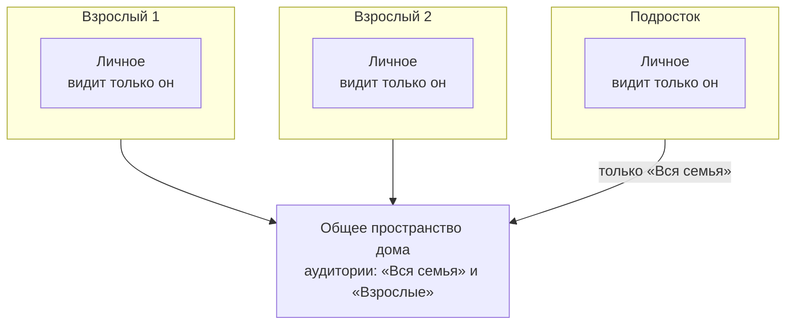

# PRD: HomeCRM — MVP «Дом и сроки»

| Поле | Значение |
|---|---|
| Статус | v0.3 — основа для разработки с 5 октября 2026: добавлены решения D15–D16 |
| Дата | 5 октября 2026 |
| Продукт | HomeCRM (рабочее название) |
| Объём | MVP: релизы R0 «Фундамент» и R1 «Дом и сроки» |
| Поверхность | PWA для телефона и компьютера |
| Основа | [Исследование и мозговой штурм](01-research-brainstorm.md); решения от 5 октября 2026 |

---

## 1. Краткое решение

HomeCRM — семейное веб-приложение для телефона и компьютера. У каждого участника свой вход и своё личное пространство, которое не видит никто другой. У семьи есть общее пространство дома.

MVP «Дом и сроки» решает три задачи:

1. **Описывает дом объектами, а не задачами.** Недвижимость, лицевые счета, счётчики, документы и контакты получают карточки со связями и лентой событий.
2. **Ведёт коммуналку и сроки.** Показания и оплаты по всем объектам, единый радар: окна показаний, сроки оплаты, поверка, сроки документов, дни рождения.
3. **Забирает из LifeOS бытовое.** Переносятся дела взрослых, повторы и покупки. Спорт, детские задачи и баллы остаются в LifeOS.

Продукт рассчитан на одну семью, но модель данных и доступа позволяет позже подключить другие семьи без переделки. ИИ в MVP не используется: он появится в R2 поверх готовой модели данных.

---

## 2. Контекст и проблема

### 2.1 Исходная ситуация

- Семья со взрослыми и детьми; несколько объектов недвижимости, часть сдаётся; основной доход — аренда.
- Сведения о доме разбросаны: голова одного взрослого, задачи LifeOS, Госуслуги Дом, бумаги, телефон.
- В LifeOS подтверждены две проблемы:
  - **H1 — модель «всё — задача».** У объектов нет карточек и истории, на вопросы «где», «какой», «когда» системе нечего ответить.
  - **H3 — хрупкая эксплуатация.** Семь контейнеров, два checkout без git, ручной перенос в прод.

### 2.2 Задачи пользователя

> **Для дома.** Когда я веду хозяйство с несколькими квартирами, семьёй и множеством сроков, я хочу, чтобы сведения жили в одном месте, а система сама напоминала о важном, — чтобы ничего не просрочить, быстро находить нужное и не держать всё в голове одному.

> **Для каждого участника.** Когда я храню личные сведения рядом с семейными, я хочу быть уверен, что их не видит никто, кроме меня, — и при этом делиться нужным одним касанием.

### 2.3 Почему не готовое решение

Западные «семейные ОС» не знают российского ЖКХ, российские приложения закрывают по одной узкой задаче. Подробно — в разделе 4 [исследования](01-research-brainstorm.md).

---

## 3. Принятые решения

| # | Решение | Основание |
|---|---|---|
| D1 | Продукт для нашей семьи. Архитектура позволяет позже обслуживать другие семьи: данные разделены по пространствам, глобальных настроек нет, регистрация закрыта | Ответ 1б |
| D2 | HomeCRM решает две подтверждённые проблемы LifeOS: модель «всё — задача» и хрупкую эксплуатацию | Ответ 2 |
| D3 | HomeCRM — новый продукт рядом с LifeOS. Переносим дела взрослых, повторы и покупки. Спорт, детские задачи и баллы остаются в LifeOS | Ответ 3а |
| D4 | MVP — «Дом и сроки» | Ответ 4 |
| D5 | У каждого участника отдельная учётная запись и личное пространство; у семьи — общее пространство | Дополнительное требование |
| D6 | Заметки входят в MVP как базовое хранилище личных сведений | Следствие D5; в мозговом штурме были в R3 |
| D7 | Основной канал уведомлений — PWA и Web Push. Telegram, e-mail и ntfy подключаются после MVP | Рекомендация, принята по умолчанию |
| D8 | ИИ в MVP не используется, все вычисления детерминированы | Рекомендация; ИИ — в R2 |
| D9 | Пароли и секреты в MVP не входят. В R3 — гибрид: Vaultwarden для критичного, «секреты дома» со сквозным шифрованием | Рекомендация; вопрос 5 исследования открыт |
| D10 | Аренда (договоры, арендаторы, арендные платежи) — в R4. До этого сдаваемые квартиры заводятся как недвижимость со статусом «сдаётся», а LifeOS Rental Control остаётся источником арендных платежей | Следствие D4 |
| D11 | Сервер пока работает на домашнем компьютере, с готовностью к переносу на VPS | Ответ 5 октября |
| D12 | Стек — TypeScript целиком: React PWA, сервер на Node, PostgreSQL | Ответ 5 октября |
| D13 | В семье двое взрослых и двое детей, у всех Android. iPhone в MVP не проверяется. Роль «Ребёнок» входит в MVP, подключать ли детей сразу — решает семья | Ответ 5 октября |
| D14 | Telegram — дополнительный канал уведомлений в R2 | Ответ 5 октября |
| D15 | Телефоны входят в приложение через VPS. У семьи есть VPS в России и за рубежом; до запуска для семьи оба сравниваются замерами с четырёх телефонов, второй VPS хранит копии и следит за доступностью | Ответ 5 октября |
| D16 | Адрес приложения — поддомен существующего домена, например `home.<домен>`. Закрепляется до первых push-подписок и больше не меняется | Ответ 5 октября |

---

## 4. Цели и метрики

| Цель | Как измеряем | Целевое значение |
|---|---|---|
| G1. Ничего не просрочено | Пропущенные окна показаний и оплаты, поверка, сроки документов | Ноль за первые 3 месяца |
| G2. Дом описан объектами | Заведены недвижимость, лицевые счета, счётчики с датой поверки, ключевые документы | Все объекты — за первую неделю |
| G3. Найти за 10 секунд | Время от открытия поиска до открытия нужной записи, сценарный тест | Медиана не больше 10 с |
| G4. Личное остаётся личным | Автоматические тесты доступа по матрице ролей в каждой сборке | Все проходят; ни одной утечки |
| G5. Быстрая запись | Дело одной строкой; показания по квартире с четырьмя счётчиками | До 10 с; до 60 с |
| G6. Семья пользуется | Взрослые, открывавшие приложение за неделю | Не меньше двух к четвёртой неделе |
| G7. Простая эксплуатация | Число сервисов; команд на обновление; проверка восстановления из копии | Три сервиса приложения плюс внешний вход; одна команда; проверка раз в месяц |

---

## 5. Не входит в MVP

| Что | Когда |
|---|---|
| ИИ: разбор фото счётчиков, квитанций и документов, голосовой ввод, вопросы к данным | R2 |
| «Входящие» как очередь разбора; QR-код квитанций | R2 |
| Уведомления в Telegram, по e-mail и через ntfy; вход по passkey | R2 |
| Пакеты документов («в лагерь», «на визу»), документы без сети | R2 |
| Пароли и секреты | R3 |
| Домашняя работа (зоны, ротация), сезонные чек-листы, инструкция к дому | R3 |
| Видимость «выбранным участникам» | R3 |
| Имущество и техника, автомобиль, платежи и подписки | R4 |
| Аренда и гостевой доступ (арендатор, няня, мастер) | R4 |
| Дети и школа, здоровье, экстренная карточка, цифровое наследство, проекты и ремонт | R5 |
| Синхронизация с внешними календарями | После R5 |
| Регистрация других семей и оплата подписки | После пилота, отдельным решением |
| Нативные приложения | Не планируются: только PWA |
| Оплата из приложения, банковские интеграции, автоматическая передача показаний | Не планируются: платим в банке и Госуслугах, у Госуслуг нет открытого API |

---

## 6. Пользователи и роли

### 6.1 Участники

| Кто | Что делает | Устройство |
|---|---|---|
| Администратор дома | Заводит объекты, коммуналку, документы; приглашает участников | Телефон и компьютер |
| Второй взрослый | Ведёт часть объектов и дел, хранит личное | Телефон |
| Подросток | Свой вход, личные заметки и дела, видит записи для всей семьи | Телефон |
| Младший ребёнок | В MVP — по желанию семьи, вход по имени пользователя | Телефон или планшет |
| Гость | Арендатор, няня, мастер — доступ по ссылке к отдельным записям | R4 |

### 6.2 Права

| Действие | Администратор | Взрослый | Ребёнок |
|---|---|---|---|
| Видеть общие записи «Вся семья» | да | да | да |
| Видеть общие записи «Взрослые» | да | да | нет |
| Создавать и менять общие записи | да | да | только покупки и дела, назначенные ему |
| Удалять общие записи в корзину | да | да | нет |
| Восстанавливать из общей корзины | да | автор записи | нет |
| Вести своё личное пространство | да | да | да |
| Видеть чужое личное | **нет** | **нет** | **нет** |
| Приглашать и исключать участников, менять роли | да | нет | нет |
| Сбрасывать пароль другому | только ребёнку | нет | нет |
| Настройки дома, экспорт общего | да | нет | нет |
| Экспорт своего личного | да | да | да |

Администратор — не «суперпользователь»: чужое личное он не видит так же, как любой другой участник.

---

## 7. Личное и общее

### 7.1 Модель: пространства

- У каждого участника есть **личное пространство**. В нём всегда один человек — владелец.
- У семьи есть **общее пространство дома**.
- Любая запись лежит ровно в одном пространстве.
- Внутри общего пространства у записи есть **аудитория**: «Вся семья» или «Взрослые».

Так устроены личный и общие сейфы в 1Password, «Мой диск» и общие диски в Google Drive.

### 7.2 Где что хранится по умолчанию

| Запись | По умолчанию | Почему |
|---|---|---|
| Недвижимость, лицевые счета, счётчики, показания, начисления, оплаты | Общее, «Взрослые» | Общее хозяйство; суммы и номера счетов детям не нужны |
| Документы взрослого: паспорт, права, полисы | Личное; в карточке — заметное действие «Поделиться со взрослыми» | Личные данные, но супругам они часто нужны |
| Документы ребёнка | Общее, «Взрослые» | Их ведут родители |
| Документы объекта: договор, выписка ЕГРН | Как у объекта | Наследуют доступ объекта |
| Организации и мастера | Общее, «Вся семья» | УК и аварийная служба нужны всем |
| Личные контакты: друзья, коллеги | Личное | — |
| Дела | По месту создания: в карточке общего объекта — общее; иначе — личное, пока его не назначили другому | Чужие личные дела не шумят у остальных |
| Заметки | Личное; в карточке общего объекта — как у объекта | — |
| Покупки | Общий список «Вся семья»; личный список — по желанию | — |
| Профиль «Обо мне» | Имя, фото, дата рождения, телефон видны семье; остальные поля — только владельцу | Дни рождения участников нужны радару |

### 7.3 Правила

1. **Личное видит только владелец.** Ни администратор, ни другие участники не видят его в списках, поиске, радаре, сводках, уведомлениях, счётчиках, истории и экспорте дома. Нельзя даже узнать, сколько у другого личных записей.
2. **Связь видна только тем, кто видит обе записи.** Личная заметка к общей квартире видна в карточке квартиры только её автору. Личные события в ленту общего объекта не попадают.
3. **Дочерние записи не видны шире родителя.** Счётчики, показания и начисления лежат в пространстве своего объекта и наследуют его аудиторию; сузить можно, расширить — нет.
4. **Исполнитель должен видеть своё дело.** Если назначить личное дело другому участнику, приложение предложит перенести его в общее пространство с подходящей аудиторией. Детям — только «Вся семья».
5. **Поделиться** личной записью (перенести в общее) может её владелец. Вместе с ней переносятся дочерние записи и файлы.
6. **Сделать личной** общую запись может только её автор и только если в ней и её дочерних записях нет вклада других участников. Иначе доступно «Скопировать в личное».
7. **Сменить аудиторию** «Вся семья» ↔ «Взрослые» может любой взрослый. Смена записывается в историю. Сузить до «Взрослых» нельзя, пока ответственный — ребёнок: сначала назначается взрослый.
8. **Сужение доступа требует подтверждения:** приложение показывает, кто потеряет доступ.
9. **Ответственный** получает напоминания по записи. В личном это всегда владелец. В общем — назначенный участник, по умолчанию автор; если его нет — администратор. Для аудитории «Взрослые» ответственным может быть только взрослый.
10. **«Сегодня», радар и поиск объединяют** личное и общее, что видит пользователь, и помечают личное значком замка.
11. **Удаление:** личное — в личную корзину, общее — в общую корзину дома. Хранение — 30 дней.
12. **Уход из дома:** личное пространство остаётся у человека вместе с его учётной записью. Общие записи остаются в доме, автор помечается «бывший участник», ответственность за его объекты переходит администратору с уведомлением.
13. **Экспорт:** каждый выгружает своё личное, администратор — общее. Чужое личное в экспорт дома не попадает.

### 7.4 Как это выглядит

- **Переключатель в шапке «Всё · Общее · Личное».** Фильтрует все разделы; выбор запоминается на устройстве. По умолчанию — «Всё».
- **Значки на записях:** замок — «Только я», два человека — «Взрослые», дом — «Вся семья». В карточке значок всегда сопровождается подписью.
- **Форма создания:** строка «Кто видит» над кнопкой «Сохранить», значение — по таблице 7.2. В режиме «Личное» новые записи по умолчанию личные, в режиме «Общее» — общие.
- **Действия в карточке:** «Поделиться…» у личной записи, «Кто видит» и «Сделать личной…» у общей.
- **Пустые состояния объясняют разницу:** «Здесь только ваши записи. Их не видит никто, кроме вас».
- **Первый вход каждого участника:** короткий экран «Как устроены личное и общее» с оговоркой из раздела 7.5.

### 7.5 Границы защиты

| От чего защищаем в MVP | Как |
|---|---|
| Другие участники дома, включая администратора, — в интерфейсе и через API | Проверка доступа на сервере в каждом запросе; автоматические тесты по матрице ролей |
| Посторонние в интернете | Только HTTPS, вход по паролю со вторым фактором, ограничение попыток |
| Потерянное устройство | Список сессий и «Выйти на всех устройствах» |
| Потеря данных | Ежедневные зашифрованные резервные копии в двух местах |

**Чего MVP не обещает.** Тот, кто администрирует сервер и имеет прямой доступ к базе и резервным копиям, технически может прочитать любые незашифрованные записи. В семейной установке это обычно администратор дома. Участники узнают об этом на первом экране. То, что должно быть скрыто и от него, будет храниться в «Секретах» со сквозным шифрованием (R3).

**Почему не шифруем всё личное сквозным шифрованием сразу.** Тогда сервер не сможет искать по личным записям и отправлять по ним напоминания: для этого ему нужны даты и тексты. Для будущей версии для других семей это отдельное требование: шифрование отдельных полей, ключи участников и регламент доступа к серверу.

---

## 8. Основные понятия

| Понятие | Значение |
|---|---|
| Пространство | Контейнер записей: личное (одного человека) или общее (дома) |
| Аудитория | Кто в общем пространстве видит запись: «Вся семья» или «Взрослые» |
| Автор | Кто создал запись |
| Ответственный | Кому приходят напоминания по записи |
| Объект | Карточка сущности: недвижимость, лицевой счёт, счётчик, документ, контакт |
| Связь | Ссылка между двумя записями с подписью роли: «сантехник», «УК», «договор» |
| Событие | Запись в ленте объекта: создание, показание, оплата, визит мастера, заметка |
| Дело | То, что нужно сделать; может быть связано с объектами |
| Срок | Дата или окно, к которому что-то должно произойти; бывает у дел и у объектов |
| Окно | Срок-интервал, например «с 20 по 25 число» |
| Радар | Всё, что требует внимания, сгруппированное по горизонтам |
| Сводка | Утренний и недельный обзор в приложении и push-уведомлении |
| Шаблон | Готовый набор объектов и сроков, например «Квартира в многоквартирном доме» |

---

## 9. Ключевые сценарии

### S1. Первая настройка дома

1. Администратор открывает ссылку установки, создаёт учётную запись и дом: название, часовой пояс.
2. Выбирает шаблон «Квартира в многоквартирном доме», вводит название и адрес.
3. Отмечает, какие услуги есть. Для каждой может указать поставщика и номер лицевого счёта или пропустить.
4. Добавляет счётчики: ресурс, тарифность, дата последней поверки, последнее показание. Всё, кроме ресурса, можно пропустить.
5. Видит радар: «Окно показаний: 20–25 октября», «Поверка ГВС: апрель 2027».

**Критерий:** первая квартира заводится не дольше 5 минут; обязательно только название.

### S2. Приглашение участника

1. Администратор создаёт приглашение с ролью «Взрослый»; ссылка действует 72 часа.
2. Участник открывает ссылку, задаёт имя, логин и пароль, сохраняет коды восстановления, устанавливает PWA и разрешает уведомления.
3. Видит экран «Как устроены личное и общее».
4. Добавляет личную заметку и свой паспорт — они помечены замком.

**Критерий:** администратор не видит эту заметку и паспорт ни в одном разделе, поиске или сводке.

### S3. Ежемесячные показания

1. 20-го числа в 9:00 ответственный получает уведомление: «Открыто окно показаний: Ленина, Цвилинга».
2. Открывает экран «Показания» по квартире: у каждого счётчика видны место установки и прошлое значение.
3. Вводит значения на цифровой клавиатуре, при желании фотографирует счётчик.
4. Приложение проверяет, что значение не меньше прошлого и нет аномалии, и показывает расход.
5. Нажимает «Передать»: значения собраны для копирования по лицевым счетам, рядом — кнопка открытия способа передачи (Госуслуги Дом, сайт поставщика).
6. Нажимает «Отметить переданными» — пункт радара закрывается.

**Критерий:** четыре счётчика — не дольше 60 секунд без учёта работы в стороннем приложении.

### S4. Квитанция и оплата

1. В карточке лицевого счёта — «Добавить начисление»: период, сумма, срок оплаты, фото квитанции.
2. За 3 дня до срока начисление появляется в радаре.
3. После оплаты — «Оплачено»: дата, сумма, способ, чек.

**Критерий:** сумма за месяц видна по объекту и по всем объектам в разделе «Коммуналка за месяц».

### S5. Документ со сроком

1. Участник добавляет загранпаспорт: владелец, номер, даты выдачи и окончания, сканы страниц.
2. Радар предупреждает за 180, 90 и 30 дней до окончания срока.
3. Действие «Продлить» создаёт новую версию документа; старая остаётся в истории.

### S6. Найти

Запрос «лицевой ленина свет» находит лицевой счёт с номером, поставщиком и способом передачи показаний. Номер копируется прямо из результата.

### S7. Мастер и история объекта

1. В карточке квартиры — «Добавить событие»: «Замена смесителя», дата, 3 500 ₽, контакт «Сантехник» (если его нет, он создаётся тут же), фото, отметка «звать снова».
2. Событие появляется в ленте квартиры и в карточке контакта.

### S8. Дело одной строкой

Ввод «завтра в 18:00 позвонить в УК #Ленина» превращается в чипы: «завтра», «18:00», связь с квартирой на Ленина; ниже — «Кто видит: только я». Сохранение — одним касанием.

### S9. Перенос из LifeOS

1. Администратор запускает пробный перенос и получает отчёт: сколько записей будет перенесено, что пропущено и почему.
2. Сопоставляет пользователей LifeOS с участниками HomeCRM.
3. Просматривает подсказки: дела с упоминанием объекта («Цвилинга») предлагается связать с объектом и сделать общими. Подтверждает пакетно.
4. Запускает перенос. Повторный запуск не создаёт дублей.

---

## 10. Функциональные требования

### 10.1 Вход и учётные записи — AUTH

- **AUTH-1.** У каждого участника своя учётная запись: логин (e-mail или имя пользователя) и пароль не короче 10 символов. Пароли хранятся только как стойкий хэш (Argon2id).
- **AUTH-2.** В дом попадают только по приглашению администратора: одноразовая ссылка с ролью, действует 72 часа. Открытой регистрации нет.
- **AUTH-3.** Второй фактор (TOTP-приложение): обязателен для администратора, рекомендован взрослым. Администратор вводит код при каждом входе; остальные участники могут отметить устройство как доверенное на 30 дней.
- **AUTH-4.** При регистрации выдаются 10 одноразовых кодов восстановления. Восстановление по e-mail работает, если на сервере настроена почта.
- **AUTH-5.** Администратор может выдать ссылку сброса пароля только ребёнку; ссылка действует 24 часа. При следующем входе ребёнок видит, что пароль сбрасывали. Пароль взрослого администратор сбросить не может. Решение владельца 5 октября 2026: по этой ссылке администратор может сам задать пароль и войти от имени ребёнка, в том числе в его личное, — ребёнок узнаёт об этом по отметке о сбросе.
- **AUTH-6.** Сессия на устройстве живёт до 90 дней и продлевается при использовании. В профиле — список устройств и «Выйти на всех устройствах».
- **AUTH-7.** Смена пароля и второго фактора и экспорт требуют повторного ввода пароля.
- **AUTH-8.** Число попыток входа ограничено, после превышения — временная блокировка. Участник видит журнал своих входов.
- **AUTH-9.** Детям не нужен e-mail: вход по имени пользователя.

### 10.2 Пространства и доступ — SPACE

- **SPACE-1.** Вместе с учётной записью создаётся её личное пространство с единственным участником.
- **SPACE-2.** Общее пространство дома администратор создаёт при первой настройке. Учётная запись может состоять в нескольких домах; в MVP дом один, переключатель домов не показывается.
- **SPACE-3.** Каждая запись принадлежит ровно одному пространству. У записей общего пространства есть аудитория: «Вся семья» или «Взрослые».
- **SPACE-4.** Доступ проверяется на сервере при каждом запросе: чтение, поиск, сводки, уведомления, файлы, экспорт.
- **SPACE-5.** Переключатель «Всё · Общее · Личное» фильтрует все разделы; выбор запоминается на устройстве.
- **SPACE-6.** Каждая запись показывает, кто её видит: значок в списке, подпись в карточке.
- **SPACE-7.** Действия «Поделиться…», «Сделать личной…», «Скопировать в личное» и смена аудитории работают по правилам раздела 7.3.
- **SPACE-8.** Администратор приглашает, исключает участников и меняет их роли. Исключение не затрагивает личное пространство участника.
- **SPACE-9.** Участник может сам покинуть дом; его личное пространство остаётся с ним. Последний администратор покинуть дом не может: сначала он назначает другого администратора.
- **SPACE-10.** Профиль «Обо мне»: имя, фото, дата рождения и телефон видны семье, остальные поля — только владельцу.

### 10.3 Объекты, связи, лента, файлы — OBJ

- **OBJ-1.** Карточка объекта: название (единственное обязательное поле), тип, поля типа, свои поля «название — значение», пространство и аудитория, автор, ответственный, файлы, связи, дела, сроки, лента.
- **OBJ-2.** Любую запись можно связать с любой видимой записью и подписать роль связи. Связь видна только тем, кто видит обе записи.
- **OBJ-3.** Лента объекта собирает события двух видов:
  - автоматические: создание, изменение ключевых полей, показания, начисления, оплаты, продление документа, выполненные связанные дела;
  - ручные: дата, текст, сумма, контакт, файлы, оценка.
- **OBJ-4.** Файлы: фото и PDF до 25 МБ. На телефоне фото сжимаются перед загрузкой; есть превью. Файл наследует доступ записи и выдаётся только после проверки доступа — публичных ссылок нет.
- **OBJ-5.** Дочерние записи — лицевые счета, счётчики, показания, начисления — лежат в пространстве родителя и не видны шире него.
- **OBJ-6.** У общих записей есть история изменений: кто, когда, какие поля. Каждое событие истории видят только те, кому запись была видна в момент события: если запись «Взрослые» открыли всей семье, дети видят её историю только с этого момента.

### 10.4 Недвижимость и коммуналка — UTIL

- **UTIL-1. Недвижимость:**
  - тип: квартира, дом, дача или участок, гараж или машиноместо, нежилое помещение;
  - адрес, площадь, кадастровый номер;
  - собственники — участники или контакты;
  - статус: «живём», «сдаётся», «пустует»;
  - ответственный;
  - УК или ТСЖ и аварийные телефоны — связями с контактами.
- **UTIL-2. Лицевой счёт:**
  - объект, поставщик (контакт-организация), услуги, номер;
  - способ передачи показаний: Госуслуги Дом, сайт или приложение поставщика (со ссылкой), телефон, автоматически, не требуется;
  - окно передачи и день срока оплаты;
  - кто платит: собственник, арендатор, другое;
  - ссылка на личный кабинет, заметки.
- **UTIL-3. Счётчик:**
  - объект и лицевой счёт;
  - ресурс: ХВС, ГВС, электроэнергия, газ, тепло;
  - модель, заводской номер, место установки;
  - тарифность (1–3 зоны), разрядность, единица измерения;
  - дата установки, дата последней поверки, межповерочный интервал;
  - дата следующей поверки — вычисляется, её можно поправить;
  - статус: работает, заменён, снят.
- **UTIL-4. Показание:** значения по зонам, дата, фото, кто снял, статус передачи («не передано» или «передано» с датой и способом), комментарий. Расход с прошлого показания считается автоматически.
- **UTIL-5. Проверки показания:**
  - значение меньше прошлого не сохраняется, кроме двух случаев: «замена счётчика» и «переход через ноль» (расход считается с учётом разрядности);
  - если расход на 40% и больше выше среднего за 6 месяцев, приложение предупреждает: «Проверьте, нет ли утечки или ошибки».
- **UTIL-6. Замена счётчика:** конечное показание старого и начальное нового. История и графики не прерываются.
- **UTIL-7. Экран «Показания» по объекту:** все активные счётчики, прошлое значение, поле ввода с цифровой клавиатурой (принимает и запятую, и точку), фото, «Сохранить всё».
- **UTIL-8. Передача показаний:**
  - значения собраны для копирования по лицевым счетам;
  - рядом — кнопка открытия выбранного способа передачи;
  - «Отметить переданными» закрывает пункт.
  Автоматической передачи нет: у Госуслуг нет открытого API.
- **UTIL-9. Начисление:** лицевой счёт, период, строки по услугам (необязательно), итог, срок оплаты, файл квитанции, перерасчёт.
- **UTIL-10. Оплата:**
  - начисление, дата, сумма, кто заплатил, чек;
  - способ: карта, автоплатёж, Госуслуги, наличные, оплатил арендатор;
  - суммы хранятся в копейках; ошибочная оплата не удаляется, а отменяется с записью в истории.
- **UTIL-11. «Коммуналка за месяц»:** по каждому объекту и по всем вместе — начислено, оплачено, к оплате, статус показаний.
- **UTIL-12. Аналитика объекта:** расход по ресурсам за 12 месяцев, суммы по месяцам, сравнение с тем же месяцем прошлого года.
- **UTIL-13. Сроки коммуналки в радаре:** окна показаний, сроки оплаты, поверка, обслуживание газового оборудования (по шаблону). Значения по умолчанию — в приложении Б.
- **UTIL-14. Начальное заполнение:** при заведении счётчика достаточно одного последнего показания; история прошлых месяцев не обязательна.

### 10.5 Документы — DOC

- **DOC-1. Типы:**
  - удостоверения личности: паспорт РФ, загранпаспорт, свидетельство о рождении, СНИЛС, ИНН, водительское удостоверение;
  - полисы: ОМС, ДМС, ОСАГО, КАСКО, страхование имущества;
  - на автомобиль и недвижимость: СТС, ПТС, выписка ЕГРН;
  - прочие: договор, гарантия и чек, медицинский документ, школьный документ, справка, другое.
- **DOC-2. Карточка:** тип, владелец (участник, контакт или объект), серия и номер, кем выдан, дата выдачи, срок действия или «бессрочно», файлы (несколько страниц), заметка, теги, ответственный за продление.
- **DOC-3.** Предупреждения о сроке зависят от типа документа (значения по умолчанию — в приложении Б) и меняются в карточке.
- **DOC-4. Паспорт РФ:** если известна дата рождения владельца, срок вычисляется по 20 и 45 годам с учётом 90 дней на замену. Предупреждения приходят до дня рождения.
- **DOC-5.** «Продлить» создаёт новую версию документа; старая остаётся в истории со статусом «недействителен».
- **DOC-6.** Номер копируется одним касанием; скан открывается на весь экран.
- **DOC-7. Фильтры списка:** по человеку, типу, сроку («истекает в 90 дней», «просрочен») и пространству.

### 10.6 Контакты — CONT

- **CONT-1. Человек:** ФИО, категории (семья, друзья, мастер, врач, репетитор, сосед, арендатор, другое), телефоны, e-mail, ссылки на мессенджеры, адрес, день рождения, организация, заметка.
- **CONT-2. Организация:** название, тип (УК или ТСЖ, ресурсоснабжающая, банк, страховая, школа, поликлиника, сервис, магазин, госорган, другое), телефоны с подписью (в том числе аварийный), сайт, адрес, часы работы, заметка.
- **CONT-3.** Контакт связывается с объектом с подписью роли. В карточке объекта есть блок «Люди и организации».
- **CONT-4. Взаимодействия:** звонок, визит, сообщение, работа — дата, текст, сумма, оценка «звать снова», объект. Видны в ленте контакта и связанного объекта.
- **CONT-5.** Быстрые действия: позвонить, написать, открыть адрес на карте.
- **CONT-6.** Импорт из vCard; при совпадении телефона приложение предлагает объединить контакты.
- **CONT-7.** Дни рождения контактов показываются в радаре, если это включено в карточке.

### 10.7 Дела, «Сегодня», «План» — TASK

- **TASK-1. Дело:**
  - название, описание;
  - пространство и аудитория, исполнитель;
  - дата плана или «без даты», точное время, крайний срок;
  - повтор и политика просрочки повтора;
  - чек-лист, связи, файлы;
  - статус: открыто, сделано, отменено, не сделано, жду.
- **TASK-2. Быстрое добавление одной строкой.** Распознавание без ИИ:
  - даты: «сегодня», «завтра», «в пятницу», «15 октября», «15.10», «через неделю»;
  - время: «в 18:00»;
  - исполнитель: «@имя»;
  - объект: «#Ленина».
  Распознанное показывается чипами до сохранения и правится одним касанием.
- **TASK-3. Повторы:** ежедневно, по дням недели, ежемесячно (число или последний день месяца), ежегодно, каждые N дней, через N дней после выполнения. Политики просрочки: перенести на следующий день, отметить «не сделано», оставить просроченным.
- **TASK-4. «Сегодня»:**
  - главное дело (одно, выбирается вручную);
  - дела на сегодня и просроченные;
  - открытые окна и срочное из радара;
  - выполненное свёрнуто.
- **TASK-5. «План»:** лента дней от сегодняшнего с подгрузкой; дела без даты — отдельно; повторы показываются серией.
- **TASK-6. «Все дела»:** фильтры «моё», «назначил другим», «без даты», «жду», по объекту.
- **TASK-7.** Выполнение можно отменить в течение 7 секунд. Повторное нажатие не создаёт двойных записей.
- **TASK-8. Статус «жду»:** от кого ждём и когда проверить. В эту дату приходит напоминание.
- **TASK-9.** Если исполнитель не видит дело, назначение требует подтвердить расширение аудитории (правило 7.3.4).
- **TASK-10.** Пункт радара превращается в дело только явным действием «Взять в работу».

### 10.8 Сроки и радар — DEAD

- **DEAD-1.** Единый движок сроков поддерживает: дату, окно, повтор, «через N после события» и предупреждения за N дней.
- **DEAD-2. Источники сроков:**
  - дела: дата, время, крайний срок;
  - лицевые счета: окна показаний, сроки оплаты;
  - счётчики: поверка;
  - начисления: срок оплаты;
  - документы: срок действия, правило паспорта РФ;
  - участники и контакты: дни рождения;
  - шаблоны: обслуживание газового оборудования, ежегодные налоги — создаются как повторяющиеся дела.
- **DEAD-3. Радар:**
  - группы: «Просрочено», «Сейчас» (открытые окна и сроки сегодня), «7 дней», «30 дней», «90 дней»;
  - фильтры по объекту, человеку и пространству;
  - переключатель «Моё · Весь дом».
- **DEAD-4. Действия пункта радара:**
  - основное — по типу: «Внести показания», «Отметить оплату», «Продлить», «Взять в работу»;
  - «Отложить до…»;
  - «Не актуально» с причиной.
- **DEAD-5. Когда пункт закрывается:**
  - окно показаний — когда у всех активных счётчиков лицевого счёта есть показание в окне и оно отмечено переданным (или способ передачи — «автоматически» или «не требуется»);
  - оплата — когда начисление оплачено;
  - документ — когда он продлён или помечен недействительным.
- **DEAD-6.** Все сроки считаются в часовом поясе дома.

### 10.9 Уведомления и сводки — NOTIF

- **NOTIF-1.** Каналы MVP: уведомления внутри приложения и Web Push — на Android и компьютере. При первом запуске приложение помогает установить PWA на телефон и разрешить уведомления.
- **NOTIF-2.** Получатели: по личной записи — владелец, по общей — ответственный (правило 7.3.9).
- **NOTIF-3. Виды уведомлений:**
  - открылось окно показаний; окно закрывается завтра;
  - оплата через 3 дня; оплата сегодня;
  - документ истекает; подходит срок поверки;
  - напоминание дела в точное время; вам назначили дело;
  - сводки.
- **NOTIF-4. Ограничения:**
  - тихие часы, по умолчанию 22:00–8:00;
  - дневной бюджет push, по умолчанию 5; сверх бюджета — в сводку;
  - настройка по видам уведомлений.
- **NOTIF-5. Сводки:**
  - утренняя (по умолчанию в 8:00): что сегодня и что срочно;
  - недельная (воскресенье, 19:00): что сделано, что на подходе, что зависло.
- **NOTIF-6.** Настройка «Скрывать текст на экране блокировки»: push показывает только «В HomeCRM есть новое».
- **NOTIF-7.** Доставка повторяется при ошибке и защищена от дублей. Журнал доставки — в настройках, а не на основных экранах.

### 10.10 Поиск — SRCH

- **SRCH-1.** Единый поиск по всем видимым пользователю записям: названия; поля (номера лицевых счетов, заводские номера, номера документов, телефоны); тексты заметок и событий; теги.
- **SRCH-2.** Поиск понимает русские словоформы и находит по части слова и номера.
- **SRCH-3.** Результаты сгруппированы по типам, отмечено пространство; номер копируется прямо из результата.
- **SRCH-4.** Чужие личные записи никогда не попадают в поиск: фильтр стоит на уровне запроса к базе.
- **SRCH-5.** Время ответа — до 300 мс (p95) на наборе из 10 000 записей.

### 10.11 Заметки — NOTE

- **NOTE-1.** Заметка: заголовок, текст с простым форматированием, чек-лист, файлы, связи, теги, закрепление.
- **NOTE-2.** По умолчанию личная; созданная в карточке общего объекта — в пространстве объекта.
- **NOTE-3.** Заметки участвуют в поиске.

### 10.12 Покупки — SHOP

- **SHOP-1.** Общий список покупок («Вся семья») и личный список. Позиция: название, количество, заметка, магазин или категория, связь с делом или объектом.
- **SHOP-2.** Отметку «куплено» можно отменить; купленное сворачивается и очищается через 7 дней.
- **SHOP-3.** Позиция добавляется одной строкой. Ребёнок может добавлять позиции в общий список.

### 10.13 Шаблоны и первый запуск — TPL

- **TPL-1.** Первый запуск администратора: создание дома, выбор шаблона, первый объект, приглашение участников (можно пропустить).
- **TPL-2.** Шаблоны MVP: «Квартира в многоквартирном доме», «Сдаваемая квартира», «Частный дом или дача». Состав — в приложении А.
- **TPL-3.** Шаблон предлагает, а не навязывает: лишние галочки снимаются, всё создаётся одним действием.
- **TPL-4.** Пустые разделы предлагают шаблон или первое действие.
- **TPL-5.** При первом входе каждый участник видит экран «Как устроены личное и общее» с оговоркой из раздела 7.5.

### 10.14 Перенос из LifeOS — IMP

- **IMP-1.** Источник — данные planner LifeOS: внутренний API или выгрузка базы (способ выбирается в плане разработки). При переносе LifeOS не изменяется.
- **IMP-2. Переносится:**
  - открытые дела взрослых и выполненные за последние 90 дней;
  - шаблоны повторов с политиками просрочки;
  - открытые покупки;
  - идеи — как личные заметки;
  - объекты аренды — как недвижимость со статусом «сдаётся».
- **IMP-3. Не переносится:** спорт, задачи детей и всё, что связано с баллами, журналы доставки напоминаний, аудит, память Hermes.
- **IMP-4. Пробный режим:** отчёт по количеству записей, пропускам с причинами и конфликтам. В пробном режиме ничего не записывается.
- **IMP-5.** Пользователи LifeOS сопоставляются с участниками HomeCRM. По умолчанию перенесённая запись — личная для своего автора.
- **IMP-6.** Дело с упоминанием объекта («Цвилинга», «Ленина») предлагается связать с объектом и сделать общим с аудиторией «Взрослые». Подсказки подтверждаются пакетно.
- **IMP-7.** Повторный запуск не создаёт дублей: соответствие «запись LifeOS → запись HomeCRM» сохраняется.
- **IMP-8. Чек-лист перехода:** после переноса новые дела взрослых заводятся только в HomeCRM, а детские задачи, спорт и баллы — только в LifeOS.

### 10.15 Корзина, экспорт, резервные копии — DATA

- **DATA-1.** Удалённое хранится в корзине 30 дней. Личная корзина — у каждого участника, общая — у дома. Запись в корзине можно только восстановить, но не изменить.
- **DATA-2.** Экспорт в JSON с файлами в ZIP. Каждый выгружает своё личное, администратор — общее. Чужое личное в экспорт дома не попадает.
- **DATA-3. Резервные копии:**
  - ежедневные, зашифрованные, хранятся в двух местах;
  - глубина хранения: 7 ежедневных, 4 недельных, 6 месячных;
  - восстановление проверяется до запуска и затем раз в месяц.
- **DATA-4.** Перед каждым обновлением, меняющим схему базы, автоматически делается резервная копия.

---

## 11. Правила продукта

1. Обязательно только название; всё остальное можно заполнить потом.
2. Личное видит только владелец — без исключений в интерфейсе, API, поиске, уведомлениях и экспорте.
3. Связь видна только тем, кто видит обе записи.
4. Пункт радара — не дело. Делом он становится только по явному действию.
5. Показание не может быть меньше предыдущего, кроме замены счётчика и перехода через ноль.
6. Аномальный расход — предупреждение, а не запрет.
7. Деньги — в копейках. Денежные записи не удаляются, а отменяются с историей.
8. Все сроки считаются в часовом поясе дома.
9. Уведомления подчиняются тихим часам и дневному бюджету; всё сверх бюджета уходит в сводку.
10. ИИ в MVP не используется: всё, что вычисляет приложение, детерминировано и объяснимо.
11. Содержимое push-уведомлений шифруется (стандарт Web Push), но на экране блокировки его видно. Поэтому есть настройка, которая скрывает текст.
12. Данные не уходят третьим сторонам; внешних счётчиков посещений и аналитики нет.
13. Экспорт доступен всегда, в открытом формате.

---

## 12. Логическая модель данных

Физическая схема — в плане разработки. Здесь — сущности и поля, важные для требований.

| Сущность | Ключевые поля |
|---|---|
| Учётная запись | имя, логин, хэш пароля, второй фактор, коды восстановления, статус |
| Сессия | учётная запись, устройство, создана, последний доступ, срок, отозвана |
| Пространство | вид (личное или дом), название, часовой пояс, настройки |
| Участник | пространство, учётная запись, роль (администратор, взрослый, ребёнок) |
| **Общие поля любой записи** | пространство, аудитория, автор, ответственный, создана, изменена, удалена |
| Недвижимость | тип, адрес, площадь, кадастровый номер, статус, собственники |
| Лицевой счёт | объект, поставщик, услуги, номер, способ передачи, окно, день оплаты, кто платит |
| Счётчик | объект, лицевой счёт, ресурс, номер, место, зоны, разрядность, поверка, интервал, статус |
| Показание и значения по зонам | счётчик, дата, значения, фото, кто снял, статус передачи |
| Начисление и строки | лицевой счёт, период, строки по услугам, итог, срок, файл |
| Оплата | начисление, дата, сумма, способ, плательщик, чек, отменена |
| Документ и версии | тип, владелец, номер, кем выдан, даты, статус, файлы |
| Контакт | человек или организация, категории, телефоны, адрес, день рождения |
| Связь | запись А, запись Б, роль |
| Событие ленты | запись, вид, дата, текст, сумма, контакт, файлы, оценка |
| Файл | ключ хранения, тип, размер, хэш, запись-владелец |
| Дело, пункт чек-листа, правило повтора | см. TASK-1 и TASK-3 |
| Срок | источник, вид, дата или окно, предупреждения, ответственный, статус |
| Заметка | заголовок, текст, чек-лист, закреплена |
| Список покупок и позиция | название, количество, магазин, куплено |
| Уведомление, подписка push | получатель, вид, канал, статус, отправлено; адрес подписки и ключи |
| История изменений | пространство, кто, что, когда, изменения |
| Соответствие импорта | источник, внешний идентификатор, запись HomeCRM |

Доступ строится на трёх общих полях — пространстве, аудитории и роли участника — и проверяется одинаково для всех сущностей.

---

## 13. Нефункциональные требования

| Область | Требование |
|---|---|
| Платформы | Android Chrome — две последние версии (основная платформа: у всей семьи Android); Chrome и Edge на компьютере. iPhone и Safari в MVP не проверяются, но интерфейс не должен использовать возможности, которых там нет |
| Скорость | Первое открытие — до 3 с на 4G; переход между экранами — до 300 мс; поиск — до 300 мс (p95) на 10 000 записей |
| Без сети | Только чтение: «Сегодня», радар, последние открытые карточки. Офлайн-очередь записей для дел, заметок, показаний с фото и отметок выполнения; синхронизация при появлении сети; конфликты видны пользователю |
| Безопасность | Только HTTPS (HSTS); Argon2id; TOTP; защищённые cookie; защита от CSRF; ограничение попыток; заголовки безопасности (CSP); проверка доступа на сервере на уровне каждого запроса к базе; автоматические тесты матрицы доступа в CI; проверка зависимостей; секретов в репозитории нет |
| Файлы | Выдаются только через проверку доступа (урок LifeOS: статические файлы без авторизации); хранилище и резервные копии зашифрованы |
| Приватность | Никакой внешней аналитики; в журналах нет названий, номеров и текстов записей; метрики целей считаются на своём сервере |
| Надёжность | Потеря данных — не больше чем за 24 часа (RPO); восстановление — до 4 часов (RTO); обработчик сроков идемпотентен; уведомления доставляются «хотя бы раз» с защитой от дублей; если обработчик не работал больше часа, администратор получает предупреждение |
| Эксплуатация | Один репозиторий под git; CI: проверка типов, линтер, модульные и интеграционные тесты с PostgreSQL, тесты доступа, сквозной смоук-тест; деплой одной командой из собранного образа; три сервиса приложения (приложение, обработчик, PostgreSQL) плюс сервис внешнего входа; миграции только вперёд, с резервной копией перед ними |
| Доступность | WCAG 2.2 AA; цели нажатия от 44 px; ширина от 360 px без горизонтальной прокрутки; увеличение текста до 200%; статусы не передаются только цветом |
| Язык и формат | Русский интерфейс; правильные формы множественного числа; даты вида «5 окт.»; суммы в рублях; в числах принимаются и запятая, и точка |
| Масштаб MVP | Один дом, до 10 учётных записей, до 50 000 записей, до 20 ГБ файлов |
| Готовность к другим семьям | Все данные разделены по пространствам; нет глобальных настроек и одиночных объектов; регистрация выключена по умолчанию |

---

## 14. Навигация и экраны

Предварительная структура; проверяется на кликабельном прототипе в R0.

**Телефон.** Нижнее меню из пяти пунктов, сверху — поиск и переключатель «Всё · Общее · Личное», кнопка «+» доступна на всех экранах.

| Пункт | Что внутри |
|---|---|
| Сегодня | Срочное из радара, главное дело, дела на сегодня, открытые окна; вкладки «Сегодня», «План», «Все дела» |
| Дом | Объекты недвижимости, «Коммуналка за месяц», карточки объектов |
| Документы | Список с фильтрами, карточки документов |
| Люди | Участники дома и контакты |
| Ещё | Заметки, Покупки, полный радар, настройки, перенос из LifeOS, корзина, экспорт |

**Компьютер.** Боковое меню со всеми разделами; переключатель пространств и поиск — в шапке.

**Экраны MVP:**

- Вход, приглашение, восстановление доступа.
- Сегодня, План, Все дела, быстрое добавление.
- Дом:
  - список объектов;
  - карточка объекта: обзор, коммуналка, счётчики, документы, люди, лента;
  - экран «Показания»;
  - «Коммуналка за месяц»;
  - карточки лицевого счёта и счётчика;
  - начисление и оплата.
- Документы: список и карточка.
- Люди: список и карточка контакта.
- Заметки, Покупки, Радар, Поиск.
- Настройки:
  - «Обо мне»;
  - безопасность: пароль, второй фактор, устройства, коды восстановления;
  - уведомления;
  - дом и участники (для администратора);
  - перенос из LifeOS, экспорт, корзина;
  - о системе: версия, состояние резервных копий (для администратора).

**Состояния:** у каждого блока свои загрузка и ошибка. Сбой одного блока не ломает экран (урок LifeOS). Без сети показывается заметная плашка.

**Визуальный язык** — Calm Focus из LifeOS: светлая кремово-зелёная палитра, иконки Phosphor, крупные цели нажатия.

---

## 15. Критерии приёмки MVP

**Доступ и личное**

1. Каждый участник входит под своей учётной записью. Сессии видны в профиле и отзываются.
2. Запись из личного пространства не видна никому другому: ни в списках, ни в поиске, ни в радаре, ни в уведомлениях, ни в экспорте дома, ни через API. Это проверяет автоматический набор тестов по матрице ролей.
3. Ребёнок не видит записи с аудиторией «Взрослые».
4. Связь личной записи с общей видна только владельцу личной записи.
5. «Поделиться» переносит запись вместе с дочерними записями и файлами. Сужение доступа требует подтверждения и показывает, кто потеряет доступ.
6. Администратор не может сбросить пароль взрослому. После сброса пароля ребёнок видит уведомление о сбросе.

**Коммуналка**

7. Для лицевого счёта с окном 20–25 пункт радара появляется 20-го числа в 9:00 по времени дома. Он закрывается, когда у всех активных счётчиков есть показание в окне, отмеченное переданным.
8. Показание меньше предыдущего не сохраняется без выбора «замена счётчика» или «переход через ноль»; при переходе через ноль расход считается верно.
9. Расход на 40% и больше выше среднего за 6 месяцев вызывает предупреждение.
10. Двухтарифный счётчик хранит значения по зонам и считает расход по каждой.
11. Начисление со сроком появляется в радаре за 3 дня; после отметки оплаты исчезает и учитывается в итоге месяца.
12. Дата следующей поверки равна дате последней поверки плюс интервал; предупреждения приходят за 60, 30 и 7 дней.
13. Показания по квартире с четырьмя счётчиками вносятся не дольше чем за 60 секунд (сценарный тест).

**Документы и контакты**

14. Документ со сроком появляется в радаре по правилам своего типа: загранпаспорт — за 180 дней.
15. Для паспорта РФ с известной датой рождения владельца срок вычисляется по 20 и 45 годам.
16. Продление документа сохраняет предыдущую версию в истории.
17. Контакт, связанный с объектом, виден в карточке объекта с ролью. Визит мастера с суммой появляется в лентах контакта и объекта.
18. Импорт vCard не создаёт дублей по телефону: при совпадении приложение предлагает объединить контакты.

**Дела, радар, уведомления, поиск**

19. Строка «завтра в 18:00 позвонить в УК #Ленина» создаёт дело с датой, временем и связью с объектом; распознанное видно до сохранения.
20. Повторы поддерживают три политики просрочки; серия показывается одной строкой.
21. Выполнение дела отменяется в течение 7 секунд.
22. Push приходит на все четыре телефона семьи (Android) с установленным PWA — и через Wi-Fi, и через мобильный интернет. Уведомления сверх дневного бюджета уходят в сводку, в тихие часы push не отправляются.
23. Утренняя сводка содержит только записи, которые видит её получатель.
24. Поиск находит запись по номеру лицевого счёта, телефону, части названия и по русским словоформам — до 300 мс (p95) на тестовом наборе из 10 000 записей.

**Перенос, эксплуатация, интерфейс**

25. Пробный перенос из LifeOS показывает отчёт и ничего не записывает. Повторный перенос не создаёт дублей. Задачи детей и всё, что связано с баллами, не переносятся.
26. Развёртывание с нуля и обновление выполняются одной командой. Восстановление из резервной копии проверено на чистом сервере.
27. Интерфейс работает на ширине 360 px без горизонтальной прокрутки, контраст соответствует WCAG AA, цели нажатия — от 44 px.
28. Сбой одного блока, например коммуналки, не ломает экран «Сегодня».
29. Первая квартира по шаблону заводится не дольше 5 минут, и ближайшее окно показаний сразу появляется в радаре.

---

## 16. После MVP

| Релиз | Содержание |
|---|---|
| R2 «Захват» | «Входящие»; шлюз ИИ-провайдеров; фото счётчика → показание; QR-код и фото квитанции → начисление; фото документа → карточка; голос → дело или заметка; вопросы к данным; каналы Telegram, e-mail и ntfy; вход по passkey; пакеты документов; документы без сети |
| R3 «Семья и быт» | Домашняя работа (зоны, ротация, дела детям — по согласованию с LifeOS); сезонные чек-листы; инструкция к дому; секреты (гибрид); видимость «выбранным участникам» |
| R4 «Имущество и деньги» | Техника, гарантии и расходники; автомобиль; платежи и подписки; аренда (перенос Rental Control) с гостевым доступом арендатора |
| R5 «Забота о семье» | Дети и школа, включая решение о переносе детских задач и баллов; здоровье; экстренная карточка; цифровое наследство; проекты и ремонт; интеграции (CalDAV, импорт из почты, Home Assistant) |
| После пилота | Решение о версии для других семей |

---

## 17. Допущения и риски

### 17.1 Допущения — проверить при настройке

- **A1.** ~~В семье двое взрослых и один-два ребёнка~~ — подтверждено: двое взрослых и двое детей (D13).
- **A2.** От двух до пяти объектов недвижимости, по 3–6 счётчиков на объект.
- **A3.** ~~Android или iPhone~~ — подтверждено: у всех Android (D13).
- **A4.** Сервер на домашнем компьютере доступен с телефонов через внешний вход с HTTPS. Вход — через VPS (D15); какой из двух, решают замеры — задача 0.2 [плана разработки](03-dev-plan.md).
- **A5.** Данные LifeOS можно прочитать через внутренний API или выгрузку базы.

### 17.2 Риски

| Риск | Как снижаем |
|---|---|
| Участник ждёт абсолютной приватности, а администратор сервера технически может прочитать базу | Честный экран при первом входе; секреты со сквозным шифрованием в R3 |
| Push на Android зависит от сервиса Google (FCM) | Проверка на всех четырёх телефонах на этапе 0; сводка внутри приложения как запасной путь; Telegram — в R2 |
| Сервер на домашнем компьютере недоступен, когда компьютер выключен | Компьютер не засыпает; после включения сервер досылает пропущенное одной сводкой; переезд на VPS подготовлен с первого дня |
| Объём MVP расползается, как в LifeOS | Фиксированный список требований; новое — только через изменение этого документа |
| Ввод данных утомляет | Шаблоны; одного последнего показания достаточно; обязательно только название |
| Две системы параллельно: LifeOS для детей и спорта, HomeCRM для взрослых | Чёткая граница (IMP-8); решение о детях — в R5 |
| Доставка Web Push в России | Проверка на реальных устройствах в R0, до работы над модулями |
| Режим «белых списков» мобильного интернета: при ограничениях открываются только разрешённые сервисы | Через Wi-Fi приложение работает; без сети — чтение и очередь записей; пропущенное досылается сводкой |

---

## 18. Открытые вопросы

Вопросы 1–4 версии 0.1 закрыты решениями D11–D14, вопрос об адресе — решением D16. Остались:

1. **Имя домена** для поддомена (D16). Нужно до первых push-подписок: подписки привязаны к адресу, и смена адреса потребует подписаться заново.
2. **Детали для шаблонов** — объекты, счётчики, поставщики — можно ввести при настройке; планированию они не мешают.

Технические вопросы — в разделе 11 [плана разработки](03-dev-plan.md).

---

## Приложение А. Шаблоны MVP

Все пункты шаблонов — предложения с галочками: что не нужно, снимается при создании.

### «Квартира в многоквартирном доме»

- **Лицевые счета:** содержание и ремонт или ЕПД (УК или ТСЖ), электроэнергия, водоснабжение и водоотведение, отопление, газ, обращение с ТКО, взносы на капремонт, интернет и ТВ, домофон.
- **Счётчики** (интервалы поверки — типовые, точное значение указано в паспорте прибора):

  | Счётчик | Интервал по умолчанию |
  |---|---|
  | ХВС | 6 лет |
  | ГВС | 4 года |
  | Электроэнергия | 16 лет |
  | Газ | 10 лет |
  | Тепло | 4 года |

- **Окна показаний:** вода — 20–25 число; электроэнергия, газ и тепло — по договору, по умолчанию тоже 20–25.
- **Срок оплаты:** 15-е число месяца, следующего за расчётным.
- **Повторяющиеся дела:** «Оплатить налог на имущество» — ежегодно до 1 декабря; «ТО газового оборудования» — раз в год, если есть газ (периодичность уточняется по договору).
- **Связи:** УК или ТСЖ, аварийно-диспетчерская служба.

### «Сдаваемая квартира»

- Всё из шаблона «Квартира в многоквартирном доме».
- Статус «сдаётся»; у каждого лицевого счёта — поле «кто платит».
- Повторяющееся дело «Получить показания от арендатора» — 20-го числа.
- Налоговые сроки по выбранному режиму:
  - НПД — до 28 числа следующего месяца;
  - НДФЛ — декларация до 30 апреля, уплата до 15 июля.

### «Частный дом или дача»

- **Лицевые счета:** электроэнергия, газ, вода (если есть), обращение с ТКО.
- **Счётчики:** электроэнергия, газ, вода.
- **Повторяющиеся дела:**
  - «ТО газового оборудования» — раз в год;
  - «Налог на имущество и земельный налог» — до 1 декабря.

---

## Приложение Б. Сроки по умолчанию

Все значения меняются в карточке записи. Время предупреждений — 9:00 по времени дома.

| Что | Когда предупреждаем | Примечание |
|---|---|---|
| Окно показаний | В день открытия; за день до закрытия; утром последнего дня | — |
| Оплата начисления | За 3 дня; в день срока | — |
| Поверка счётчика | За 60, 30 и 7 дней | — |
| Паспорт РФ | За 60 и 30 дней до 20-летия и 45-летия | После дня рождения — 90 дней на замену |
| Загранпаспорт | За 180, 90 и 30 дней | Многие страны требуют, чтобы паспорт действовал ещё 6 месяцев |
| Водительское удостоверение | За 90 и 30 дней | — |
| ОСАГО, КАСКО, страхование имущества | За 30, 14 и 3 дня | — |
| Договор | За 60 и 30 дней | — |
| Гарантия | За 30 дней | — |
| Прочие документы со сроком | За 30 и 7 дней | — |
| День рождения | За 7 дней и в день | — |
| Налог на имущество | 1 и 20 ноября | Срок уплаты — 1 декабря |

Источники норм — в разделе 7 и в списке источников [исследования](01-research-brainstorm.md). Сроки ЖКХ различаются у поставщиков, поэтому настраиваются на каждом лицевом счёте.
