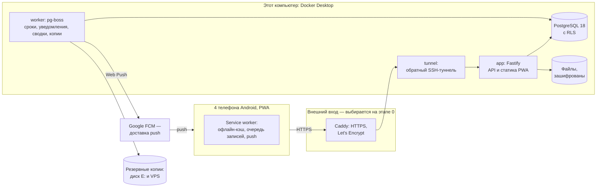

# План разработки HomeCRM: MVP «Дом и сроки»

| Поле | Значение |
|---|---|
| Статус | v0.2 — принят, этап 0 начат 5 октября 2026 |
| Дата | 5 октября 2026 |
| Основа | [PRD v0.3](02-prd.md), решения D1–D16 |
| Объём | Этап 0, R0 и R1 — это и есть MVP; R2–R5 — обзорно |
| Кто делает | ИИ-агенты (Codex, Claude Code); вы — владелец продукта: принимаете решения, проверяете выпуски на телефонах |

---

## 0. Коротко

1. **Стек:** монорепозиторий на TypeScript.
   - клиент: React 19 + Vite + PWA;
   - сервер: Node 24 LTS + Fastify 5;
   - база: PostgreSQL 18 с политиками доступа на уровне строк (RLS);
   - фоновые задачи: pg-boss;
   - push-уведомления: Web Push.
2. **Где работает.** Docker Desktop на этом компьютере. Те же образы без изменений запустятся на VPS. Наружу ничего не открывается: все порты слушают только `127.0.0.1`.
3. **Главная находка для плана.** С июня 2025 года российские провайдеры замедляют Cloudflare, а также зарубежные хостинги вроде Hetzner и DigitalOcean: часто загружаются только первые 16 КБ. Поэтому вход для телефонов лучше держать в России. У вас есть VPS и в России, и за рубежом: на этапе 0 оба получают Caddy и туннель до этого компьютера, а замеры с четырёх телефонов покажут, какой оставить входом. Второй VPS хранит резервные копии и следит за доступностью. VPS, выбранный входом, потом станет и постоянным сервером.
4. **Порядок работ:**
   - этап 0 — проверка рисков;
   - R0 «Фундамент»: вход, личное и общее, заметки, файлы, push, поиск, резервные копии;
   - R1a «Дом и коммуналка»;
   - R1b «Документы и контакты»;
   - R1c «Дела, радар, сводки»;
   - R1d «Перенос из LifeOS и запуск».
5. **Сроки — ориентир:** около 11–13 недель до выпуска MVP плюс 2 недели пилота. Промежуточная цель — **провести окно показаний 20–25 ноября 2026 уже в HomeCRM**.
6. **Этап 0 начат 5 октября:** git, каркас репозитория, правила для агентов, замеры доступа и push.

---

## 1. Технические решения

Продуктовые решения D1–D14 — в [PRD](02-prd.md). Ниже технические; каждое на этапе 0 оформляется отдельной записью ADR в `docs/adr/`.

| # | Решение | Почему | Запасной вариант |
|---|---|---|---|
| T1 | Монорепозиторий pnpm: `apps/web`, `apps/server`, `packages/shared`, `packages/db` | Общие схемы и типы для клиента и сервера: нет расхождений, как между Dashboard и Mini App в LifeOS | — |
| T2 | Node 24 LTS + Fastify 5 | Зрелые модули для cookie, ограничения запросов, загрузки файлов, заголовков безопасности; агенты хорошо его знают | Hono |
| T3 | PostgreSQL 18 + Drizzle ORM; SQL-миграции в git | Типобезопасные запросы; Drizzle описывает политики RLS прямо в схеме | Prisma |
| T4 | Двойная защита доступа: фильтр в коде и политики RLS в PostgreSQL | Код пишут агенты, и забытый фильтр — самая вероятная ошибка. RLS не пропустит чужое личное, даже если фильтр забыт | Только фильтр в коде |
| T5 | Авторизация на Better Auth: вход по имени пользователя, TOTP и коды восстановления, сессии с отзывом, ограничение попыток; позже passkey. Применяется, если пройдёт проверку 0.3 | Не писать сессии и криптографию с нуля | Минимальная своя реализация на Argon2id и проверенных библиотеках |
| T6 | Фоновые задачи и расписания — pg-boss в той же PostgreSQL | Без Redis и лишних сервисов | graphile-worker |
| T7 | React 19 + Vite, TanStack Query, React Router, Radix UI, иконки Phosphor, токены Calm Focus из мобильного прототипа LifeOS | Продолжение выбранного дизайна; распространённые библиотеки | — |
| T8 | PWA на vite-plugin-pwa (стратегия injectManifest): свой service worker для push и офлайна; кэш и очередь записей — в IndexedDB (Dexie) | Push и офлайн требуют своего service worker | — |
| T9 | Web Push через библиотеку `web-push` (ключи VAPID) | Стандартный путь для Chrome на Android | — |
| T10 | Файлы — в томе Docker, шифрование AES-256-GCM, превью через sharp. Хранилище спрятано за интерфейсом, позже его можно заменить на S3-совместимое | Просто сейчас, переносимо потом | — |
| T11 | Поиск — средствами PostgreSQL: полнотекстовый с русской морфологией и pg_trgm для номеров и частей слов | Без отдельного поискового сервиса | Meilisearch |
| T12 | Моменты времени — в UTC, даты без времени — отдельным типом, часовой пояс дома — в настройках; date-fns и @date-fns/tz | Сроки считаются по местному времени дома | Luxon |
| T13 | Тесты: Vitest (модульные и интеграционные с настоящей PostgreSQL), Playwright (сквозные, на размерах экрана Android), axe (доступность) | Набор, который уже работал в LifeOS | — |
| T14 | Резервные копии — pg_dump и restic (шифрование, дедупликация) на диск E: и на второй VPS. На VPS — restic rest-server в режиме «только добавление»: с компьютера нельзя удалить старые копии, очистку выполняет сам VPS. Запускает обработчик по расписанию | Зашифрованные копии в двух местах; ошибка агента или вирус на компьютере не уничтожит историю копий | SFTP |
| T15 | Один образ Docker для приложения и обработчика, разные команды запуска | Меньше сборок, меньше расхождений | — |
| T16 | Инструменты: pnpm 12, TypeScript 7 в строгом режиме, Biome — форматирование и линтер. Сервер запускает TypeScript прямо в Node 24 (удаление типов) без шага сборки; в коде — только стираемый синтаксис, без enum и namespace | Меньше инструментов и шагов сборки, быстрые проверки | Сборка через tsdown |
| T17 | Приватный репозиторий на GitHub. GitHub Actions запускает `pnpm check` на каждый запрос на слияние и на `main`; та же проверка — локально перед `git push` | История и проверки вне этого компьютера | Только локальный git |

---

## 2. Архитектура

### 2.1 Схема



### 2.2 Сервисы

| Сервис | Что делает | Где работает |
|---|---|---|
| `app` | API, вход, раздача PWA | Этот компьютер, `127.0.0.1:8300` |
| `worker` | Движок сроков, уведомления, сводки, резервные копии, импорт | Этот компьютер |
| `db` | PostgreSQL 18; данные в томе Docker | Этот компьютер; наружу не публикуется |
| `tunnel` | Обратный SSH-туннель до внешнего входа; ключ без права на оболочку, только перенаправление порта | Этот компьютер |
| `edge` | Caddy с автоматическим HTTPS | VPS |

Порты 8300 и 8301 выбраны так, чтобы не пересекаться с LifeOS (8000, 8642, 9119, 9120). После переезда на VPS `app`, `worker` и `db` переходят туда, а `tunnel` больше не нужен.

### 2.3 Репозиторий и данные

```text
E:\Projects\HomeCRM\              код, под git
├─ apps\web\                      React PWA
├─ apps\server\                   Fastify: API и обработчик (две точки входа)
├─ packages\shared\               схемы zod, типы, правила сроков, разбор быстрой строки
├─ packages\db\                   схема Drizzle, миграции, политики RLS, вымышленные данные
├─ deploy\compose.yaml            один файл для компьютера и VPS (профили)
├─ deploy\caddy\                  конфигурация внешнего входа
├─ deploy\scripts\                копии, восстановление, выпуск, выгрузка из LifeOS
├─ deploy\tunnel\, deploy\edge\   туннель с компьютера и настройка VPS
├─ tools\access-probe\            заглушка для замеров этапа 0; удаляется после R0
├─ tests\e2e\                     Playwright
├─ .github\workflows\             проверки GitHub Actions
├─ docs\                          исследование, PRD, план, adr\, stage0\, runbook.md
├─ AGENTS.md                      правила для Codex
└─ CLAUDE.md                      правила для Claude Code, ссылается на AGENTS.md

E:\HomeCRM-data\                  рабочие данные, вне git
├─ secrets\                       файл окружения, ключи шифрования, ключи VAPID
├─ backups\                       локальное хранилище restic
└─ import\                        выгрузка из LifeOS
```

База и файлы лежат в томах Docker: так PostgreSQL работает быстрее и надёжнее, чем на папке Windows. Секреты в репозиторий не попадают никогда.

### 2.4 Как обеспечивается «личное остаётся личным»

1. **Общие поля.** В каждой таблице с пользовательскими данными есть пространство, аудитория, автор, ответственный и отметка удаления.
2. **Контекст запроса.** После входа сервер знает, в каких пространствах состоит пользователь и с какой ролью. Каждая транзакция устанавливает `app.account_id`, а все запросы идут через общий помощник с фильтром доступа.
3. **Политики RLS** на всех таблицах с данными. Строка видна, если:
   - пространство личное и принадлежит пользователю, или
   - пользователь — участник дома, и аудитория записи «Вся семья» или его роль — администратор или взрослый.
4. **Роли базы.** Приложение подключается к базе ролью без права обходить RLS. Миграции выполняет отдельная роль-владелец. Системные задачи обработчика (пересчёт сроков) работают отдельной ролью. Уведомления формируются для конкретного получателя с повторной проверкой, что он видит запись.
5. **Поиск и файлы** подчиняются тем же правилам. У строк поискового индекса и файлов те же поля доступа. Файл выдаётся только через проверяющий маршрут, по случайному ключу хранения.
6. **Матрица доступа в CI** перебирает комбинации: сущность × автор, другой взрослый, ребёнок, администратор, посторонний × личное, «Вся семья», «Взрослые» × список, карточка, поиск, изменение, удаление, экспорт, уведомление. Любое расхождение с ожидаемым блокирует слияние.

### 2.5 Движок сроков

- Источники сроков (дела, лицевые счета, счётчики, начисления, документы, дни рождения) обновляют таблицу сроков в той же транзакции, что и сами записи. Раз в сутки — полный идемпотентный пересчёт.
- Ежемесячные окна показаний создаются на два месяца вперёд.
- Каждые 5 минут обработчик находит наступившие предупреждения и создаёт намерения уведомить. Ключ идемпотентности — «срок + предупреждение + получатель», поэтому повторов не бывает.
- Диспетчер применяет тихие часы, дневной бюджет и настройку скрытия текста, затем отправляет push или откладывает в сводку.
- **Досылка после простоя.** Если компьютер был выключен, после запуска пропущенное приходит одним уведомлением: «Пока сервер был выключен: 3 события». Подробности — в приложении.

### 2.6 Офлайн

- Оболочка приложения кэшируется. «Сегодня», радар и последние открытые карточки сохраняются в IndexedDB и доступны для чтения без сети.
- Очередь записей без сети: дела, заметки, показания с фото, отметки выполнения. У каждой записи ключ идемпотентности. Генератор работает и там, где нет `crypto.randomUUID` (урок LifeOS). Сервер хранит квитанции ключей; конфликты видны пользователю.
- При выходе локальные данные учётной записи удаляются. Если в очереди есть неотправленное, приложение предупреждает.

### 2.7 Файлы

- На телефоне фото уменьшаются до 2560 px перед загрузкой; предел — 25 МБ.
- На сервере у каждого файла свой ключ шифрования, а сами ключи зашифрованы главным ключом из `secrets`. Превью тоже шифруются.
- Скачивание идёт только через маршрут с проверкой доступа; чувствительные файлы не кэшируются браузером.
- **Главный ключ** и пароль хранилища restic хранятся в вашем менеджере паролей, а также на бумажном листе восстановления. Без них из резервной копии файлы не восстановить.

### 2.8 Уведомления

- Подписка push хранится на каждое устройство: адрес, ключи, название устройства, дата последней успешной доставки.
- Ответы 404 и 410 удаляют устаревшую подписку; остальные ошибки — повтор с увеличением паузы.
- В push передаётся минимум: вид, идентификатор записи, короткий текст. Нажатие открывает нужный экран.
- Каналы — за общим интерфейсом. В MVP — Web Push. В R2 добавятся Telegram (с поддержкой прокси, потому что из России Telegram API почти недоступен), e-mail и ntfy.
- **Ключи VAPID** переносятся вместе с сервером. Если их потерять, все подписки придётся оформлять заново.

### 2.9 Перенос из LifeOS

1. Скрипт `deploy/scripts/export-lifeos.ps1` только читает базу LifeOS — через `docker exec` и `psql \copy` — и складывает JSON в `E:\HomeCRM-data\import\`. Секреты LifeOS не читаются и не выводятся.
2. Команда `pnpm import:lifeos --dry-run` показывает отчёт, `--apply` записывает данные и сохраняет соответствие «запись LifeOS → запись HomeCRM».
3. Сопоставление пользователей LifeOS с участниками — отдельный файл, который вы подтверждаете.
4. Правила отбора:
   - дела только взрослых; назначенные детям и связанные с баллами — пропускаются;
   - политики просрочки повторов переносятся;
   - идеи становятся личными заметками;
   - объекты аренды становятся недвижимостью со статусом «сдаётся».
5. Слова-подсказки для связи с объектами задаются списком: «Цвилинг» → квартира на Цвилинга.

### 2.10 Окружения

| Окружение | Где | Данные | Для чего |
|---|---|---|---|
| Разработка | Этот компьютер: Vite и Node в режиме наблюдения, PostgreSQL в Docker | Вымышленная семья | Работа агентов |
| Тесты | CI и локально | Одноразовая база на каждый прогон | Проверки перед слиянием |
| Предпросмотр | Этот компьютер, отдельный compose-проект, `127.0.0.1:8301` | Вымышленные данные | Показ семье перед выпуском; смоук-проверка ключевых экранов |
| Рабочее | Этот компьютер, compose-проект `homecrm` | Настоящие данные | Семья |

---

## 3. Как работаем

### 3.1 Правила для агентов — `AGENTS.md` и `CLAUDE.md`

Полный текст — в [AGENTS.md](../AGENTS.md), обоснование порядка работы — в [ADR-0019](adr/0019-agent-workflow.md). Главное:

- **Одна задача — один свежий агент** с брифом; после отчёта он завершается. Память проекта — в репозитории, а не в переписке.
- **Изоляция.** У каждого исполнителя свой `git worktree`, ветка и тестовая база; рабочее окружение агенты не трогают. Параллельно — до двух задач в непересекающихся областях; миграции и правила доступа — по одной.
- **Исполнитель коммитит сам**, ведущий агент сливает в `main` и ставит метки версий.
- **Одно ревью на изменение:** исправляются только блокеры, остальное — в [бэклог](backlog.md).
- **Тесты по затронутому** — во время работы. Перед слиянием — независимая проверка в CI, включая матрицу доступа. Полный визуальный прогон — ночью на этом компьютере, отдельно от рабочего окружения.
- **Отчёт до 15 строк:** сделано, файлы, проверки с цифрами, риски, что нужно от вас.
- **Новая сущность с данными** — только вместе с полями доступа, политикой RLS, строками матрицы доступа, решением о поиске, экспортом и поведением корзины.
- Секреты не выводятся и не сохраняются. Файлы — UTF-8 без BOM; после правки русских текстов — `pnpm check:encoding`: он ловит `????`, `�`, `Рџ`, `Ð` (правило из LifeOS). <!-- encoding-check: ignore-line -->
- Требования меняются сначала в PRD, потом в коде. Новая зависимость — с обоснованием, заметное решение — с ADR.
- Выпуск в рабочее окружение — только по вашей команде.

### 3.2 Когда задача готова

- Поведение соответствует требованию PRD.
- Тесты написаны и проходят, матрица доступа дополнена.
- Типы и линтер чистые, в консоли браузера нет ошибок.
- Тексты на русском проверены.
- Для интерфейса: скриншоты 360 и 412 px, axe без серьёзных и критичных замечаний.
- Документация обновлена, если поведение изменилось.
- Отчёт до 15 строк — в описании запроса на слияние; таблица хода работ в разделе 10 обновлена.

### 3.3 Выпуск

1. Метка версии `vX.Y.Z` и сборка образа.
2. Автоматическая резервная копия.
3. Миграция базы.
4. Перезапуск.
5. Смоук-проверка: `/health`, вход, ключевые маршруты.
6. Запись в `CHANGELOG.md`.

**Откат:** предыдущий образ, а если миграция несовместима — восстановление копии, сделанной перед ней. Выпуски — в конце каждого подэтапа, с проверкой на телефонах семьи.

### 3.4 Репозиторий и проверки

Git — с первого коммита; удалённый репозиторий — приватный на GitHub (T17).

- **GitHub Actions** запускает `pnpm check` на каждый запрос на слияние и на каждую отправку в `main`.
- **Ограничение бесплатного тарифа:** в приватном репозитории GitHub не умеет запрещать слияние без зелёных проверок. Поэтому правило держится на двух вещах: перед `git push` локальная ловушка запускает `pnpm check`, а `AGENTS.md` запрещает её обходить и сливать с красными проверками.
- **Бюджет минут:** 2000 минут в месяц для приватных репозиториев. Устаревшие прогоны отменяются, зависимости кэшируются.
- **Полный визуальный прогон** идёт ночью на этом компьютере и минут GitHub не тратит (ADR-0019). Появится вместе с первыми сквозными тестами в R0.

---

## 4. Этапы и задачи

### Этап 0. Проверка рисков — около 1 недели

Цель — до основной разработки проверить самые рискованные допущения.

| # | Задача | Готово, когда |
|---|---|---|
| 0.1 | Git, каркас монорепозитория, CI, `AGENTS.md`, `CLAUDE.md`, ADR по разделу 1 | `pnpm check` проходит на пустом каркасе |
| 0.2 | **Внешний вход и push.** Заглушка PWA с push на этом компьютере (`tools/access-probe`), доступная тремя путями: А1 — российский VPS, А2 — зарубежный VPS (оба с Caddy и обратным SSH-туннелем), Б — временный Cloudflare Tunnel, только для сравнения. Отдельно — скорость отправки с компьютера на каждый VPS, для резервных копий | Таблица [замеров](stage0/access-measurements.md): четыре телефона, Wi-Fi и мобильный интернет каждого оператора; загрузка от 16 КБ до 5 МБ, отправка 1 МБ, задержка API, доставка push. Вход выбран. Туннель сам восстанавливается после перезагрузки компьютера |
| 0.3 | **Проверка Better Auth:** вход по имени без e-mail, TOTP и коды восстановления, список и отзыв сессий, ограничение попыток, свои правила сброса пароля, приглашения с ролью | Прототип на Fastify и Drizzle; решение записано в ADR |
| 0.4 | **Проверка RLS:** политики для личного и общего пространства, контекст запроса, роль приложения без обхода RLS | Три таблицы-примера; матрица доступа проходит |
| 0.5 | **Кликабельный прототип навигации** на основе мобильного прототипа LifeOS: «Сегодня», «Дом», «Документы», «Люди», «Ещё» и переключатель «Всё · Общее · Личное» | Второй взрослый выполняет пять заданий без подсказок; замечания внесены в PRD |
| 0.6 | Адрес приложения | Поддомен закреплён в ADR и больше не меняется |

**Как выбираем внешний вход (0.2):**

- Основной кандидат — российский VPS: замедление зарубежных хостингов его не касается.
- Зарубежный VPS становится входом, только если на всех четырёх телефонах и у всех операторов он не хуже российского.
- Cloudflare Tunnel — только для сравнения.
- VPS, который не стал входом, хранит резервные копии и следит за доступностью — если отправка на него с компьютера достаточно быстрая. Иначе копии идут на российский VPS, в отдельное хранилище.

### R0. Фундамент — 2–3 недели

**Цель:** все четверо входят со своих телефонов, личные и общие заметки работают от начала до конца, push приходит, резервные копии делаются.

| # | Задача | Требования PRD |
|---|---|---|
| R0.1 | Схема базы: учётные записи, пространства, участники, общие поля записей, история изменений, корзина; политики RLS; роли базы | SPACE-1…4, OBJ-6, DATA-1 |
| R0.2 | Вход: учётные записи, приглашения с ролью, TOTP (обязательно для администратора), коды восстановления, устройства и сессии, ограничение попыток, сброс пароля ребёнку | AUTH-1…9 |
| R0.3 | Каркас PWA: навигация, переключатель пространств, значки и строка «Кто видит», пустые состояния, установка на телефон, ошибки по блокам | SPACE-5…6, TPL-4 |
| R0.4 | **Заметки — первый сквозной модуль:** личные и общие, «Поделиться», «Сделать личной», «Скопировать в личное», корзина | NOTE-1…3, SPACE-7 |
| R0.5 | Основа объектов: связи, лента событий, файлы с шифрованием и превью, свои поля | OBJ-1…5 |
| R0.6 | Поиск: индекс с русской морфологией и триграммами, фильтр доступа, экран поиска | SRCH-1…5 |
| R0.7 | Основа уведомлений: подписки push, диспетчер с тихими часами и бюджетом, скрытие текста на экране блокировки, журнал доставки, досылка после простоя | NOTIF-1, 4, 6, 7 |
| R0.8 | Ядро движка сроков: таблица сроков, расписание, предупреждения, часовой пояс дома | DEAD-1, DEAD-6 |
| R0.9 | Профиль «Обо мне», участники дома, настройки | SPACE-8…10 |
| R0.10 | Экспорт личного и общего | DATA-2 |
| R0.11 | Эксплуатация (подробно — ниже) | DATA-3, DATA-4 |
| R0.12 | Матрица доступа в CI для всех сущностей R0 | G4 |

Что входит в R0.11:

- compose для рабочего окружения и предпросмотра;
- внешний вход по итогам 0.2;
- копии restic в два места и проверка восстановления;
- `/health` и внешний сторож;
- `docs/runbook.md`.

**Выход из R0:** критерии приёмки 1–6 и 26; push доходит до всех четырёх телефонов; взрослые работают в приложении; восстановление из копии проверено.

### R1a. Дом и коммуналка — 2–3 недели

| # | Задача | Требования PRD |
|---|---|---|
| R1a.1 | Недвижимость: типы, статусы, собственники, ответственный; карточка объекта с вкладками | UTIL-1 |
| R1a.2 | Организации — сколько нужно для поставщиков и УК; связи с объектами | CONT-2, CONT-3 |
| R1a.3 | Лицевые счета: способы передачи, окна, срок оплаты, кто платит | UTIL-2 |
| R1a.4 | Счётчики: зоны, разрядность, поверка, замена | UTIL-3, UTIL-6 |
| R1a.5 | Показания: экран ввода по объекту, проверки, переход через ноль, фото, передача и отметка | UTIL-4, 5, 7, 8, 14 |
| R1a.6 | Сроки коммуналки в радаре и уведомления о них — **первыми, к окну 20–25 ноября** | UTIL-13, DEAD-2, NOTIF-3 |
| R1a.7 | Шаблоны «Квартира в многоквартирном доме», «Сдаваемая квартира», «Частный дом или дача»; первый запуск администратора | TPL-1…3 |
| R1a.8 | Начисления и оплаты: суммы в копейках, отмена вместо удаления | UTIL-9, UTIL-10 |
| R1a.9 | «Коммуналка за месяц» и аналитика объекта | UTIL-11, UTIL-12 |

Порядок внутри R1a подобран так, чтобы к 20 ноября работали объекты, лицевые счета, счётчики, показания и напоминания об окне. Начисления и аналитика можно доделать после.

**Выход из R1a:** критерии 7–13 и 29; настоящие квартиры и счётчики заведены; окно 20–25 ноября проведено в HomeCRM.

### R1b. Документы и контакты — 1,5–2 недели

| # | Задача | Требования PRD |
|---|---|---|
| R1b.1 | Документы: типы, карточка, версии и продление, фильтры | DOC-1, 2, 5, 6, 7 |
| R1b.2 | Правила сроков документов, паспорт РФ по возрасту | DOC-3, DOC-4 |
| R1b.3 | Люди: карточки людей и организаций, связи с объектами, взаимодействия, быстрые действия | CONT-1…5 |
| R1b.4 | Импорт vCard с объединением дублей | CONT-6 |
| R1b.5 | Дни рождения участников и контактов в радаре | CONT-7 |

**Выход из R1b:** критерии 14–18.

### R1c. Дела, радар, сводки, покупки — около 2 недель

| # | Задача | Требования PRD |
|---|---|---|
| R1c.1 | Дела: модель, статусы, чек-листы, связи, «жду» | TASK-1, TASK-8 |
| R1c.2 | Быстрая строка: даты, время, `@исполнитель`, `#объект`; набор из 100+ тестовых русских фраз | TASK-2 |
| R1c.3 | Повторы, политики просрочки, серии | TASK-3 |
| R1c.4 | «Сегодня», «План», «Все дела», отмена выполнения, назначение с расширением аудитории, «Взять в работу» | TASK-4…7, TASK-9, TASK-10 |
| R1c.5 | Полный радар: группы, фильтры, действия, закрытие пунктов | DEAD-2…5 |
| R1c.6 | Утренняя и недельная сводки; уведомления о делах | NOTIF-2, 3, 5 |
| R1c.7 | Покупки | SHOP-1…3 |
| R1c.8 | Офлайн: кэш для чтения и очередь записей | Раздел 13 PRD |

**Выход из R1c:** критерии 19–24.

### R1d. Перенос из LifeOS и запуск — 1–2 недели, затем пилот 2 недели

| # | Задача | Требования PRD |
|---|---|---|
| R1d.1 | Выгрузка из LifeOS только для чтения; импортёр с пробным режимом, сопоставлением пользователей и подсказками объектов | IMP-1…7 |
| R1d.2 | Экран первого входа «Как устроены личное и общее» | TPL-5 |
| R1d.3 | Производительность: 10 000 вымышленных записей; поиск и «Сегодня» | SRCH-5 |
| R1d.4 | Доступность и полировка: 360 и 412 px, axe, контраст, тексты | Критерий 27 |
| R1d.5 | Переход: импорт, чек-лист IMP-8, короткое обучение семьи | IMP-8 |
| R1d.6 | Пилот две недели, исправления по его итогам | G1–G7 |

**Выход из R1d:** все критерии приёмки 1–29 выполнены, MVP принят.

---

## 5. Сроки

Ориентир при старте 6 октября. Уточняется после этапа 0.

| Этап | Длительность | Примерные даты |
|---|---|---|
| Этап 0 | 1 неделя | 5–12 октября, начат 5 октября |
| R0 «Фундамент» | 2–3 недели | 13 октября — 31 октября |
| R1a «Дом и коммуналка» | 2–3 недели | 2–20 ноября; окно показаний 20–25 ноября — в HomeCRM |
| R1b «Документы и контакты» | 1,5–2 недели | до 4 декабря |
| R1c «Дела, радар, сводки» | около 2 недель | до 18 декабря |
| R1d «Перенос и запуск» | 1–2 недели | до конца декабря |
| Пилот | 2 недели | первая половина января |

**Допущения оценки:**

- код пишут агенты;
- вы тратите около часа в день на решения, просмотр и проверку на телефоне;
- по умолчанию идёт одна задача за раз; до двух параллельно — каждая в своём worktree (ADR-0019).

Новогодние праздники попадают на пилот — это может помочь: семья дома и успевает освоиться.

---

## 6. Тестирование

| Уровень | Что проверяем | Инструмент | Когда |
|---|---|---|---|
| Модульные | Правила сроков; проверки показаний (зоны, переход через ноль, аномалии); повторы и политики просрочки; разбор быстрой строки; правило паспорта | Vitest | Каждый коммит |
| Интеграционные | API с PostgreSQL: создание и изменение, идемпотентность, история, корзина, экспорт, импорт | Vitest и одноразовая PostgreSQL | Затронутые — локально; все — на каждом запросе на слияние |
| Матрица доступа | Каждая сущность × роль × пространство × операция | Генерируемый набор | Каждый запрос на слияние; провал блокирует слияние |
| Сквозные | Сценарии S1–S9 на ширине 360 и 412 px | Playwright в контейнере на Linux | Изменённые экраны — во время работы; все сценарии — ночью на этом компьютере и перед выпуском |
| Доступность | Основные экраны | axe в Playwright | Вместе со сквозными |
| Производительность | Поиск и «Сегодня» на 10 000 записей | Скрипт с вымышленными данными | Перед выпуском |
| Восстановление | Копия → чистый compose-проект → смоук-проверка | Скрипт | Перед запуском, затем раз в месяц |
| Настоящие телефоны | Установка PWA; push по Wi-Fi и мобильному интернету; офлайн-очередь | Чек-лист на четырёх телефонах | Каждый выпуск |

В тестах и на скриншотах — только вымышленная семья, настоящих данных нет. Тесты на этом компьютере идут отдельно от рабочего окружения: свой compose-проект, своя база, свои порты (ADR-0019).

| Критерии приёмки PRD | Чем проверяются |
|---|---|
| 1–6 (доступ и личное) | Матрица доступа и сквозные тесты |
| 7–13 (коммуналка) | Модульные и сквозные; 13 — сценарный замер |
| 14–18 (документы и контакты) | Модульные и интеграционные |
| 19–24 (дела, радар, уведомления, поиск) | Модульные, сквозные, телефонный чек-лист, замер поиска |
| 25 (перенос) | Интеграционные тесты на копии выгрузки LifeOS |
| 26 (эксплуатация) | Скрипт развёртывания и восстановления |
| 27–29 (интерфейс и первый запуск) | Playwright, axe, сценарный замер |

---

## 7. Эксплуатация на этом компьютере и переезд на VPS

### 7.1 Что нужно от компьютера

- **Не засыпает.** В настройках электропитания сон отключён.
- **Docker Desktop запускается при входе в Windows** и сам поднимает контейнеры: `restart: unless-stopped`.
- **После перезагрузки** Docker Desktop стартует только после входа пользователя. Вы подтвердили, что компьютер работает круглосуточно и автоматический вход можно включить. Включаете его вы сами, по инструкции в [runbook](runbook.md): Autologon от Microsoft Sysinternals хранит пароль зашифрованным, а сразу после входа задача планировщика блокирует экран. Сервисы поднимаются, рабочий стол остаётся под паролем. Внешний сторож сообщит, если сервис всё же не поднялся.
- **Обновления Windows** перезагружают компьютер только ночью, например с 3:00 до 5:00.
- **Наружу ничего не открывается:** только `127.0.0.1` и исходящий туннель.
- **Windows 10** не получает основной поддержки с 14 октября 2025 года. Поэтому порты наружу не открываем, систему держим обновлённой — это ещё один довод за переезд на VPS.
- **После отключения питания** компьютер должен включаться сам (настройка BIOS). ИБП — по желанию.

### 7.2 Резервные копии

- **Каждую ночь в 3:30** — pg_dump и файлы в restic: на диск `E:\HomeCRM-data\backups` и на второй VPS (rest-server в режиме «только добавление», T14).
- **Глубина хранения:** 7 ежедневных, 4 недельных, 6 месячных копий. Старые копии на VPS удаляет сам VPS. Раз в неделю — проверка целостности хранилища.
- **Перед каждым выпуском** с миграцией — отдельная копия.
- **Раз в месяц** — восстановление в отдельный compose-проект со смоук-проверкой и отчётом.
- **Ключи восстановления** — в менеджере паролей и на бумажном листе дома.

### 7.3 Наблюдение

- **`/health`** показывает: база, пульс обработчика, возраст последней копии, ошибки доставки push.
- **Внешний сторож на втором VPS** — не на том, что служит входом, чтобы заметить и падение самого входа. Каждые 5 минут он проверяет адрес приложения. Если оно недоступно 15 минут, администратор получает оповещение; когда приложение снова работает — тоже. Канал — Telegram, если сторож на зарубежном VPS; запасной — e-mail.
- **Раз в неделю** в сводке администратора — «Состояние системы»: последняя копия, последняя проверка восстановления, доля доставленных push, свободное место.

### 7.4 Переезд на VPS

1. На VPS — Linux, Docker и тот же `compose.yaml` с профилем `vps`; Caddy уже стоит там как внешний вход.
2. На компьютере — последняя копия; на VPS — восстановление и смоук-проверка.
3. Caddy переключается с туннеля на локальное приложение.
   - Адрес не меняется, поэтому установленные PWA, сессии и push-подписки продолжают работать.
   - Ключи VAPID и главный ключ шифрования переносятся вместе с данными.
4. Компьютер остаётся холодным резервом и хранит копии.

Простой — до 30 минут. Срок переезда — не позже начала R2 (захват с ИИ) или раньше, если компьютер окажется ненадёжным.

---

## 8. После MVP

| Релиз | Технические заметки |
|---|---|
| R2 «Захват» | Шлюз ИИ-провайдеров: зарубежная модель через VPS, YandexGPT, GigaChat или локальная модель. ИИ готовит только черновики со строгой схемой ответа. QR-код квитанции распознаётся на телефоне без ИИ. Адаптер Telegram с прокси. Passkey (плагин Better Auth). Сводки по e-mail |
| R3 «Семья и быт» | Секреты: Vaultwarden на VPS и хранилище «секретов дома» со сквозным шифрованием на проверенной библиотеке. Домашняя работа — с решением о детских задачах LifeOS |
| R4 «Имущество и деньги» | Перенос Rental Control. Гостевые ссылки: подписанные, с истечением срока, на одну запись. Техника, автомобиль, подписки |
| R5 «Забота о семье» | Дети и школа (решение о задачах и баллах LifeOS). Здоровье — приватно по умолчанию, рассмотреть шифрование полей. Экстренная карточка без сети, цифровое наследство с задержкой доступа. CalDAV, импорт из почты, Home Assistant |

---

## 9. Риски плана

| Риск | Как заметим | Что делаем |
|---|---|---|
| Внешний вход нестабилен у части операторов | Замеры этапа 0 | Вход — на российском VPS; Cloudflare — только запасной вариант |
| Режим «белых списков» мобильного интернета: открываются только разрешённые сервисы | Замеры, жалобы семьи | Через Wi-Fi работает; без сети — чтение и очередь записей; пропущенное досылается сводкой |
| Внешний вход отложен, и доставка push на телефоны проверяется поздно | Таблица хода работ, раздел 10 | Доставку push можно проверить без VPS — через USB-кабель (`adb reverse`), по одному телефону. VPS — не позже R0.7 |
| Push не доходит (FCM) | Замеры этапа 0, журнал доставки | Сводка в приложении; Telegram в R2; ntfy для взрослых как запасной канал |
| Компьютер выключен или перезагрузился | Внешний сторож | Досылка пропущенного, автозапуск, переезд на VPS |
| Better Auth не подходит под наши правила | Проверка 0.3 | Своя минимальная авторизация на проверенных примитивах |
| Ошибка доступа в коде агента | Матрица доступа, RLS | Слияние блокируется; RLS страхует |
| Объём расползается | Задачи вне PRD | Сначала изменение PRD, потом код |
| Docker Desktop перестанет поддерживать Windows 10 | Предупреждения при обновлении | Фиксируем версию; переезжаем на VPS |
| Дела заводятся и в LifeOS, и в HomeCRM | Пилот | Чек-лист перехода IMP-8 |

---

## 10. Ход этапа 0

| Задача | Состояние на 5 октября |
|---|---|
| 0.1 Git, каркас, CI, правила для агентов, ADR | Готово: `pnpm check` проходит; порядок работы агентов — ADR-0019; репозиторий на GitHub подключён |
| 0.2 Внешний вход и push | Отложено вашим решением 5 октября: пока всё работает локально. Заглушка, туннель и скрипт настройки VPS готовы; отправка push в FCM с этого компьютера проверена. Срок — до R0.7 |
| 0.3 Проверка Better Auth | Следующая |
| 0.4 Проверка RLS | Следующая |
| 0.5 Кликабельный прототип навигации | После 0.3 и 0.4 |
| 0.6 Адрес приложения | Вместе с 0.2 |

**Почему 0.2 нельзя отложить дольше R0.7.** Без внешнего входа телефоны не откроют приложение вне домашнего Wi-Fi, а push не заработает вовсе: подписка на push возможна только с адреса с HTTPS. Это нужно уже для уведомлений в R0.7, для выхода из R0 (критерий 22) и для окна показаний 20–25 ноября.

**Что нужно от вас сейчас:**

- настройки компьютера из [runbook](runbook.md), раздел 1;
- второй взрослый проходит кликабельный прототип (0.5).

**Позже, для 0.2:** имя домена и записи DNS, доступ к VPS, замеры на четырёх телефонах.

---

## 11. Вопросы

**Ответы 5 октября 2026:**

1. VPS есть и в России, и за рубежом — сравниваем оба (D15).
2. Адрес — поддомен существующего домена (D16).
3. Репозиторий — приватный на GitHub с проверками (T17).
4. Компьютер работает круглосуточно, автоматический вход можно включить (раздел 7.1).
5. Репозиторий — `github.com/gidraq-jpg/HomeCRM`. VPS настраиваем позже, пока всё локально.

**Отложено до настройки VPS** (задача 0.2):

1. Имя домена и где управляется его DNS.
2. Для каждого VPS: система (Debian, Ubuntu…), порт SSH и что уже работает на портах 80 и 443 — например, VPN.
3. VPS настраиваете вы по runbook или даёте агенту SSH-доступ по ключу?

---

## Источники

- [Медиазона: «16-килобайтный занавес» — замедление Cloudflare в России](https://en.zona.media/article/2025/06/19/cloudflare)
- [Cloudflare: российские пользователи не могут получить доступ к открытому интернету](https://blog.cloudflare.com/russian-internet-users-are-unable-to-access-the-open-internet/)
- [Коммерсантъ: трафик Cloudflare в России снизился на 30%](https://www.kommersant.ru/doc/8292616)
- [Опыт отказа от Cloudflare для сайта в РФ, 2026](https://dimaserbun.ru/en/blog/cloudflare-v-rf-pochemu-otkazalsya/)
- [Better Auth](https://github.com/better-auth/better-auth)
- [Drizzle ORM: RLS в PostgreSQL](https://orm.drizzle.team/docs/rls)
- [vite-plugin-pwa](https://github.com/vite-pwa/vite-plugin-pwa)
- [pg-boss](https://github.com/timgit/pg-boss)
